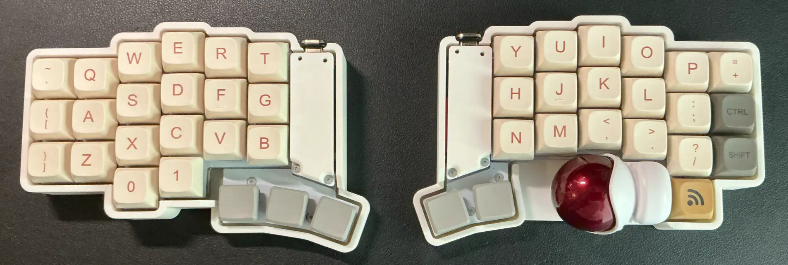
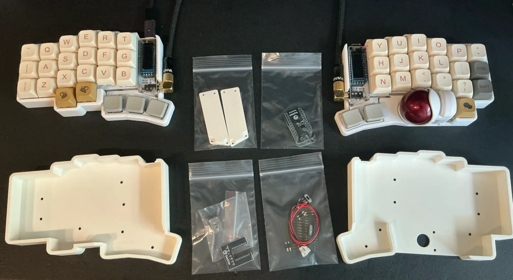

import X from '@theme/Icon/Socials/X';



Keyball44を無線化したお話です。

無線化までの経緯や、省電力化のための試行錯誤を書きます。

## なぜKeyball44を無線化したかったのか

主な理由は下記の通り。

- 普段3台のデバイスを使用しており、USBケーブルを差し替えて使うのは面倒くさい
- デバイスのUSBポートを1つ消費してしまう
- 卓上がケーブルでゴチャゴチャする

これらを解消するためには無線化しかないですが、知識のない自分にとってはハードルが高い。  
無線化されたトラックボール付き分割キーボードは既に販売されている物はありましたが、ほぼ売り切れ状態、、

- [torabo-tsuki トラックボール付き無線分割キーボードキット](https://booth.pm/ja/items/5774326)
- [roBa 【トラックボール付きワイヤレス自作キーボードキット】](https://booth.pm/ja/items/6010869)
- [moNa2](https://booth.pm/ja/items/6376654)

ということで、無線化をほぼ諦めていたところこのような商品を発見。

- [SeaSideX【Keyball無線化キット】(旧SeaSide39)](https://seasideworks.booth.pm/items/6657043)

これは買うしかない、ということで迷わすポチりました。




専用ケースも買ってしまった。

そしてマイコン・バッテリーもそれぞれ2つずつ購入。

- [Seeed Studio XIAO nRF52840](https://www.amazon.co.jp/dp/B09T9VVQG7)
- [DC 3.7V 220mAh 502025](https://www.amazon.co.jp/dp/B0CKRBTW8Z)  

推奨バッテリーが売り切れてたので、サイズが同じものを独自で調べて買ったものになります。しかしこのバッテリーですが、[極性が逆になっており、組み立て時に極性を逆にして取り付ける必要があります](https://github.com/hama-be/SeaSideX-documentation/blob/main/docs/buildguide.md#2-2-1-%E3%83%90%E3%83%83%E3%83%86%E3%83%AA%E3%83%BC%E3%81%AE%E9%81%B8%E3%81%B3%E6%96%B9%E3%81%A8%E6%B3%A8%E6%84%8F%E7%82%B9
)。

こんな感じで、ビルドガイドとは逆に基盤にコネクタをはんだ付け対応しました。


以下無線化前のものをKeyball44、無線化後のものをSeaside44と呼んでいきます。

## 組み込み作業について

実際に無線化キットを組み込む作業ですが、Keyball44を組み立てる時より工程は少ないので短時間で完了します。しかし難易度はKeybaal44より高いと感じました。

注意点としては、

- バッテリの極性（先述の通り）  
→　極性を逆で接続すると、マイコンが壊れてしまいます。
- コンスルーピン用のスルーホールとマイコン用のスルーホールが近い  
→　コンスルーピンをはんだ付けしているときに、下手するとマイコン用のスルーホールにはんだが流れて穴を埋めてしまいます。
- [SeaSide44用配線](https://github.com/hama-be/SeaSideX-documentation/blob/main/docs/buildguide.md#3-8-2-seaside44%E7%94%A8%E9%85%8D%E7%B7%9A)  
→　上手くはんだ付けしないと、バッテリー装着時に干渉して上手く収まりません。また熱しすぎると被覆が溶けて見た目が汚くなるし、ショートの原因にもなりそう。

という感じです。これらはすべて私がやらかしてしまったことです。

これらさえ気をつけて作業をすれば、素人の私でも完成できましたので、難易度が高すぎるというわけではないですが、はんだ付けや細かい作業に自信がない人は注意しておいた方がよさそうです。


## 省電力化の設定

ファームウェアの書き換えは[ビルドガイド](https://github.com/hama-be/SeaSideX-documentation/blob/main/docs/buildguide.md#4-5-zmk%E3%83%95%E3%82%A1%E3%83%BC%E3%83%A0%E3%82%A6%E3%82%A7%E3%82%A2%E3%81%AE%E3%82%AB%E3%82%B9%E3%82%BF%E3%83%9E%E3%82%A4%E3%82%BA%E3%81%A8%E3%83%93%E3%83%AB%E3%83%89%E6%96%B9%E6%B3%95)にある通りに行えばOKです。

基本このまま使うとバッテリー持ちが悪いなと感じましたので、色々設定を変えて試してみます。

### ロータリーエンコーダーを無効化

keyballにはロータリーエンコーダーは付いてないので、設定を削除。

```diff title="SeaSide44_L.conf"
- CONFIG_EC11=y
- CONFIG_EC11_TRIGGER_GLOBAL_THREAD=y
```

### Bluetooth接続数調整


左側は基本右側（中央側）への接続しか行わないので、Bluetooth接続数を1に変更。

```diff title="SeaSide44_L.conf"
+ # buluetooth の最大接続数を 1 に設定
+ CONFIG_BT_MAX_CONN=1
```

右側（中央側）も用途に応じて変更します。

```diff title="SeaSide44_R.conf"
+ # buluetooth の最大接続数を 4 に設定
+ CONFIG_BT_MAX_CONN=4
```

### Bluetooth送信電力を弱める

基本、接続先とは1m以内で使用しているので、送信電力を弱めても問題なささそう。

左右両方対応します。

```diff title="SeaSide44_L.conf"
+ # Bluetooth の送信電力を -12dBm に設定
+ CONFIG_BT_CTLR_TX_PWR_MINUS_12=y
```

```diff title="SeaSide44_R.conf"
+ # Bluetooth の送信電力を -12dBm に設定
+ CONFIG_BT_CTLR_TX_PWR_MINUS_12=y
```

これでBluetooth接続が不安定になれば`CONFIG_BT_CTLR_TX_PWR_MINUS_8=y`とかにしてみる。

### 左側のバッテリー情報を中央側で管理しないように


```diff title="SeaSide44_R.conf"
# BLE スプリットキーボードのバッテリー情報を中央側で管理
- CONFIG_ZMK_SPLIT_BLE_CENTRAL_BATTERY_LEVEL_PROXY=y
+ CONFIG_ZMK_SPLIT_BLE_CENTRAL_BATTERY_LEVEL_PROXY=n
# BLE スプリットキーボードのバッテリー情報を取得
- CONFIG_ZMK_SPLIT_BLE_CENTRAL_BATTERY_LEVEL_FETCHING=y
+ CONFIG_ZMK_SPLIT_BLE_CENTRAL_BATTERY_LEVEL_FETCHING=n
```

左右両方のバッテリー情報を管理するようにしても、ホスト側で対応していなければ左右どちらかのバッテリー残量しか表示されない。基本右手側（中央側）の方が電池消耗は早いはずなので、右手側のみのバッテリー残量が表示できれば問題ない。

左手側のバッテリー残量はLEDで判断する運用にするため、左側もバッテリー残量のLED表示対応追加。

```diff title="SeaSide44_L.conf"
+ # 電源オン時のLEDインジケータの有効/無効
+ CONFIG_RGBLED_WIDGET=y
+ # バッテリー残量が30%未満の時黄色、20%未満の時赤色表示
+ CONFIG_RGBLED_WIDGET_BATTERY_LEVEL_HIGH=30
+ CONFIG_RGBLED_WIDGET_BATTERY_LEVEL_CRITICAL=10
```

## 気付いたこととか

無線化をして当初の目的は達成できました。配線の煩わしさから解放され、マルチデバイスで快適に利用できるようになりました。

実際に無線化してみて、当初は想定していなかった、メリットやデメリットをまとめてみたいと思います。

### メリット・よかったこと
- Shiftを押さなくても横スクロールができるようになった  
QMKの時はスクロールレイヤ+Shiftキーを押して横スクロールしていたが、ZMKになってスクロールレイヤだけで横スクロールができるようになったので楽になった。(もしかしたらQMKでもできたのかもしれない)
- [ZMK Keypam Editor](https://nickcoutsos.github.io/keymap-editor/)でキーマップを編集して、そのままgit hubに連携できる  
ファームウェアを書き換えてキーマップが元に戻ってしまうということがなくなった。QMKの時はファームウェア書き換え後、[Remap](https://qmk018.remap-keys.app/)でキーマップを設定していた。
- 最大レイヤ数が増えた  
QMKの時は6レイヤまでしか追加できなかったけど、それ以上追加しても問題なさそう(どこまで追加できるか試してないけど)。WINとMac用のレイヤを分けたりとか、柔軟な運用ができそう。QMKの時は左右で別々のキーマップを設定して対応してたりしてた。
- USB接続でも動作する  
Bluetoothの接続が不安定だったり、バッテリー電源がなくなった場合は、USBで接続すればUSB接続で動作する。USBとBluetooth両方接続した場合は、USB接続の方が優先される模様。


### デメリット・残念だったこと
- USBにマグネットコネクタを使うと、電源スイッチが切り替えづらい。  
マイコンからUSBメス部分がもげるのを防ぐため、無線化前からマグネットコネクタを使用しておりましたが、これをSeaside44で使用すると電源スイッチとかなり近くなってしまい、結構操作しづらくなってしまった。  

- スクロールがシビア  
ZMKになったからなのか、トラックボールの基盤が省電力版になったからなのか、スクロール動作が思ったように行かなくなり、スクロールし過ぎるというミス操作が増えてしまった。ファームウェアで調整できるかもしれないが、QMKの時はファームウェアを書き換えなくてもスクロールスピードの調整はできた。ZMKだとそういう操作が見当たらないので、いちいちファームウェアを書き換えて調整するしかなさそう。  
この辺りは慣れてくれば気にならなくなってくるかも。


## 感想

まだ使い始めて時間はたっていないですが、今のところ問題なく動作しており理想通りの形になってくれたのかなと思います。あとは省電力設定が効いて電池持ちが長くなれば最高です。

最後にSeasideXの開発・販売をしてくださった <a href="https://x.com/ybybybmh" target="_blank" rel="noopener noreferrer"><X style={{ verticalAlign: 'middle', height: '13px', width: '13px' }} />はま</a> さん、本当にありがとうございました！
