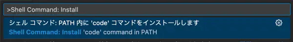
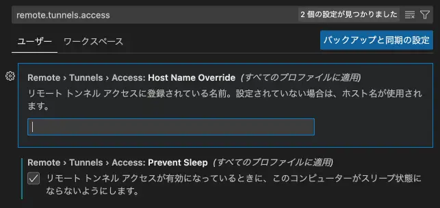
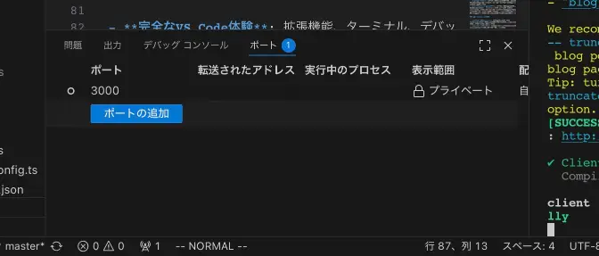
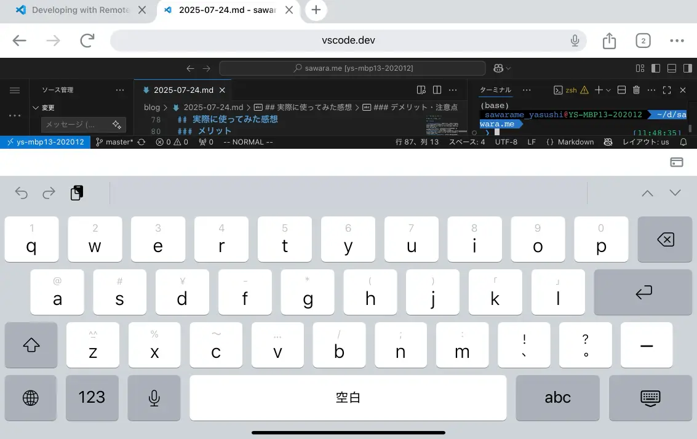

<!--  -->

iPadを本格的なプログラミング開発端末として活用するための方法として、VS Code Tunnelsを使った開発環境の構築手順を紹介します。

## iPadで開発するメリット

iPadで開発するということに特に理由はありません。ただiPadを持っているから、といのが主な理由です。

私が持っているのはiPad miniなので、手軽に持ち運びできるデバイスで開発ができれば便利そうと思ったのがきっかけではあります。

しかし、iPadでプログラミング開発となると、いくつかの壁があります。 

- **OSの制約**: iPadOSでは、ローカルサーバーを立てたり、Dockerコンテナを動かしたりといった、モダンな開発で必須となる作業が難しい。
- **IDEがない**: PCで使っているような高機能なIDE（統合開発環境）がiPadにはない。

これらの課題を解決し、iPadで開発できるようにするのが「VS Code Tunnels」です。


## VS Code Tunnelsとは？

[VS Code Tunnels](https://code.visualstudio.com/docs/remote/tunnels)は、一言で言うと「**手元のPCで動いているVS Code環境に、どこからでもブラウザ経由で安全にアクセスできる機能**」です。

メインの開発マシン（MacやWindows、Linux）でトンネルを有効にすると、`vscode.dev` というURLを通じて、iPadのブラウザからいつものVS Code環境をそのまま利用できるようになります。

## 構築手順

セットアップは非常に簡単です。ホストとなるPC側でいくつかのコマンドを実行するだけです。

### 1. ホストマシンでの設定

まず、メインで使っている開発マシン（ここではMacを例にします）で設定を行います。

#### VS Code CLIのインストール

VS Codeには、コマンドラインから操作するための`code`コマンドが付属しています。
VS Codeを開き、コマンドパレット（`Cmd+Shift+P`）から「`Shell Command: Install 'code' command in PATH`」を実行して、`code`コマンドをインストールします。



#### トンネルを有効にする

ターミナルを開き、以下のコマンドを実行します。

```bash
code tunnel
```

初めて実行すると、GitHubアカウントでの認証を求められます。指示に従ってブラウザでログインと認証を完了させてください。

認証が成功すると、ターミナルに以下のようなメッセージが表示され、トンネルが有効になります。

```text
*
* Visual Studio Code Server
*
* By using the software, you agree to the Visual Studio Code Server License Terms (https://aka.ms/vscode-server-license) and
* the Microsoft Privacy Statement (https://privacy.microsoft.com/en-US/privacystatement).
*
Open this link in your browser https://vscode.dev/tunnel/YOUR_TUNNEL_NAME/
```

この `https://vscode.dev/tunnel/YOUR_TUNNEL_NAME/` というURLが、iPadからアクセスするためのURLになります。

ちなみに`YOUR_TUNNEL_NAME`はVS Codeの設定remote.tunnels.accessから変更できます



### 2. iPadからのアクセス

次に、iPadでブラウザ（Safariなど）を開き、先ほどターミナルに表示された `https://vscode.dev/tunnel/YOUR_TUNNEL_NAME/` のURLにアクセスします。

すると、見慣れたVS Codeの画面がブラウザ内に表示されます。これで準備は完了です。

<!-- !VS Code on iPad -->

## 実際に使ってみた感想

### メリット

- **どこでもVS Codeが使える**: 拡張機能、ターミナル、デバッガなど、デスクトップ版とほぼ変わらない機能が使えます。ファイルの編集はもちろん、`git`コマンドの実行やサーバーの起動も可能です。
- **環境構築が不要**: iPad側にはブラウザさえあればOK。面倒な環境構築は一切必要ありません。
- **どこでも開発**: ホストマシンが起動していれば、外出先のカフェや移動中の新幹線の中でも、iPadひとつで本格的な開発ができます。
- **ポートフォワーディング**: ホストマシンで起動したWebサーバー（例: `localhost:3000`）も、VS Codeの「ポート」タブから外部に公開設定をすることで、iPadのブラウザからプレビューできます。これもブラウザのVS Code上から設定できるので、事前にサーバーを起動しておく必要はありません。


### デメリット・注意点

- **ホストマシンが必須**: 当然ですが、VS Code Tunnelsはホストマシンが起動していて、インターネットに接続されている必要があります。
- **ネットワーク依存**: 通信環境によっては、入力の遅延などが気になる場面があるかもしれません。
- **外付けキーボードは必須**: ソフトウェアキーボードでのコーディングは現実的ではありません。iPadの持ち運びの容易さのメリットは失いますが、物理キーボードの持ち運びも必須になります。

ソフトウェアキーボードだとほとんど編集領域が見ない、、
- **専用アプリが欲しい**: ブラウザ上で動作するので、ショートカットキーがブラウザで反応してしまったりするので、VS Code Tunnels専用のアプリがあるといいなとお思いましたが、現状なさそうでした。

## まとめ

VS Code Tunnelsは、iPadを本格的な開発用端末として活用するための非常に強力なソリューションです。

メインの開発マシンを母艦とし、iPadを身軽なクライアントとして使うことで、開発の自由度は格段に上がります。

「ちょっとした修正を外出先でしたい」「重いノートPCを持ち歩きたくない」といったニーズに完璧に応えてくれるVS Code Tunnels。iPadをお持ちの開発者の方は、ぜひ一度試してみてはいかがでしょうか。
