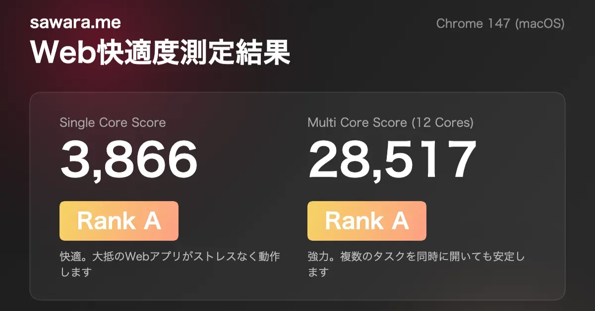
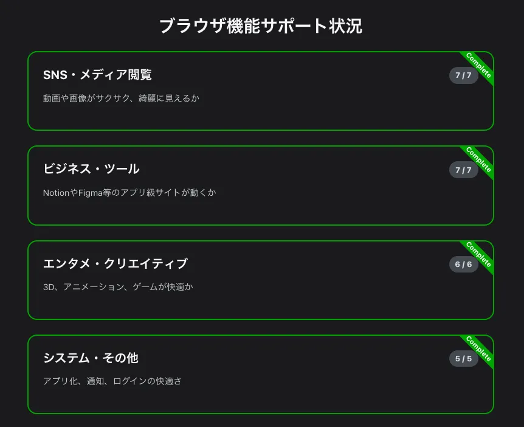

このサイトには「Web快適度測定」という機能があります。

この機能がなんなのか、どのようなことをやっているのか、便利な使い方を紹介します。



<!-- truncate -->

### 開発の経緯：対応デバイスを決めるの、むずくない？

この機能を作ったきっかけは、現在業務で開発しているサービスの「対応デバイス（サポート端末）」を検討していた時のことでした。

「AndroidはOS12以上」「Safari 16以上」「Chrome 110以上」といった基準はよくありますが、実際にはスペックの低いAndroid端末もあれば、OSやブラウザは最新でもパワーが不足しているデバイス、逆に古くてもパワーのある旧ハイエンド端末もあります。
開発チームで「どこまでの低スペック端末を切り捨てるか（あるいはサポートするか）」を議論する際、明確な基準がないことに非常に苦労しました。

そこで、**「ブラウザ上で手軽に動かせて、その端末の『Web的な実力』を数値化できるベンチマークがあれば、そのスコアを基準に対応デバイスを定義できるのでは？」** と思いついたのが、この機能の始まりです。

---

### Web快適度測定の基本仕様

このツールは、大きく分けて2つの測定を行います。

1.  **演算性能の測定（スコア化）**:  
  端末のCPUパワーを測定し、シングルコア・マルチコアそれぞれのスコアとランク（S〜F）を出します。
2.  **ブラウザ機能サポート状況**:  
  最新のWeb API（WebGPU, Passkeys, WebP等）がそのブラウザで使えるかをチェックします。

測定結果は以下のように、1枚の画像として生成して共有することも可能です。

---

### ベンチマークの処理の詳細

#### 1. Web Workerによる正確な測定
ベンチマーク中、メインスレッド（UIを動かすスレッド）が固まってしまうと正確な時間が測れません。そのため、演算処理はすべて **Web Worker** に逃がして実行しています。

```javascript
// Web Worker 上で実行される演算ロジックの一部
const workerScript = `
self.onmessage = function(e) {
  // 1. 浮動小数点演算 (sin, cos, sqrt)
  let floatSum = 0;
  for (let i = 0; i < 10000000; i++) {
    floatSum += Math.sin(i) * Math.cos(i) + Math.sqrt(i);
  }

  // 2. 整数・ビット演算
  let intSum = 0;
  for (let i = 0; i < 50000000; i++) {
    intSum += (i * 1337) ^ (i << 2);
  }

  // 3. メモリアクセス
  const size = 5000000;
  const arr = new Int32Array(size);
  // ... 配列へのランダムアクセス処理
};
`;
```

#### 2. マルチコア測定の実装
デバイスの論理コア数（`navigator.hardwareConcurrency`）を取得し、その数だけ同時に Worker を立ち上げて並列処理を行わせます。`Promise.all` を活用して全ての Worker の完了を待機し、総合的なスループットからスコアを算出するようにしました。これにより、最近の多コアスマホの実力をしっかり引き出せるようにしています。

```javascript
async function runMultiCoreBenchmark(cores, passes, onProgress) {
  const workers = [];
  const startAll = performance.now();
  let completedPasses = 0;
  const totalPasses = passes * cores;

  // デバイスの論理コア数分だけ Worker を作成して実行
  for (let i = 0; i < cores; i++) {
    workers.push(runWorkerTask(passes, () => {
      completedPasses++;
      // 全体の進捗率を計算してUIに通知
      if (onProgress) {
        const percent = Math.floor((completedPasses / totalPasses) * 100);
        onProgress(`マルチコア測定中... (${percent}%)`);
      }
    }));
  }

  // すべての並列処理が終わるまで待機
  await Promise.all(workers);
  const endAll = performance.now();
  
  // 実行時間から最終的なマルチコアスコアを計算
  const totalTime = endAll - startAll;
  return Math.floor((500_000 * cores * passes) / totalTime);
}
```

#### 3. ブラウザ機能のサポートチェック
単に計算が速いだけでなく、現代のWebサービスを支える最新のAPIに対応しているかどうかも、体験の質に大きく関わります。以下の4つのカテゴリで診断を行っています。

- **SNS・メディア閲覧**:  
「動画や画像がサクサク、綺麗に見えるか」を判定します。次世代画像の **AVIF/WebP** や、高効率ビデオコーデックの **AV1**、優先読み込みを行う **fetchpriority** などをチェック。これらに対応していると、表示速度が劇的に向上し、通信量も抑えられます。
- **ビジネス・ツール**:  
NotionやFigma等のアプリ級サイトが快適に動くか」を判定します。ポップアップを制御する **Popover API** や、ブラウザ上でのZIP圧縮を可能にする **Compression Streams**、オフライン対応の **IndexedDB v3** などをチェック。これらは高機能なWebツールの安定性に直結します。
- **エンタメ・クリエイティブ**:  
「3D、アニメーション、ゲームが快適か」を判定します。次世代3Dグラフィックスの **WebGPU** や、滑らかな画面遷移を実現する **View Transitions API**、スクロール連動演出の **Scroll-driven Animations** などをチェック。リッチな視覚表現が可能になります。
- **システム・その他**:  
「アプリ化、通知、ログインの快適さ」を判定します。指紋・顔認証でのログインを可能にする **Passkeys (WebAuthn)** や、画面をスリープさせない **Screen Wake Lock API**、ローカルファイルを直接編集できる **File System Access API** などをチェック。ブラウザが「単なる閲覧ソフト」から「OS」に近づくための機能群です。

これらの判定結果を表示し、アコーディオン形式でそれぞれどの機能に現在使用しているブラウザが対応しているか、確認できるようになっています。



---

#### 4. 結果の可視化と共有（Web Share API & Canvas）
測定して終わりではなく、結果を誰かに伝えたり記録したりしやすいよう、共有機能も追加しています。ブラウザの **Web Share API** を使ってOS標準の共有メニューを直接呼び出せます。HTML5 Canvas を使用し、スコア・ランク・環境情報を表示した結果画像を自動で作成し、そのままX（旧Twitter）やLINE、メッセージアプリへ送信できます。

---

### 便利な使い方・活用シーン

単なる「性能測定」以上に、以下のような具体的なシーンで活用してもらえると嬉しいです！

- **手元のデバイスの「実力」を知る**:  
  手元にあるスマートフォンやタブレット、PCがどれくらいのWeb処理能力があるのか確認することができます。特にミドルレンジ以下の端末では、最新機能のサポート状況を知る良い指標になります。
- **ブラウザによる性能特性の比較**:  
  同じデバイスでも、Safari（WebKit）とChrome（Blink）ではJSエンジンの実装が異なります。どちらが演算に強く、最新機能に対応しているかを比べてみて、自分のデバイスにあったブラウザを見つけてみてください。
- **プロジェクトのターゲットデバイス選定**:  
  開発プロジェクトで「今回はBランク以上の端末を推奨環境とする」といった具体的な数値を定義するために。OSバージョンや発売日といった曖昧な指標ではなく、現在のWebブラウザにおける「実力値」をベースにした議論が可能になります。

ぜひ、皆さんの手元のデバイスでも [Web快適度測定](/benchmark) を試してみてください！
