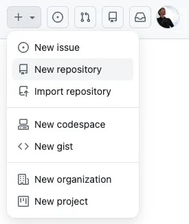
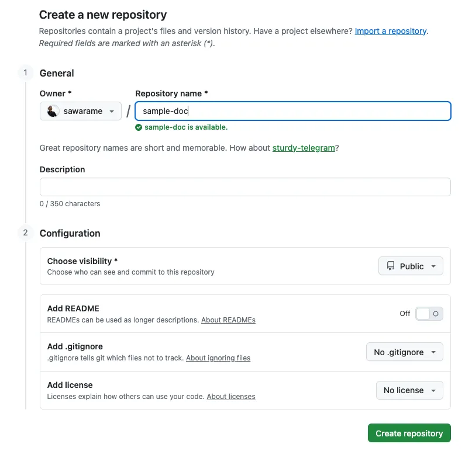
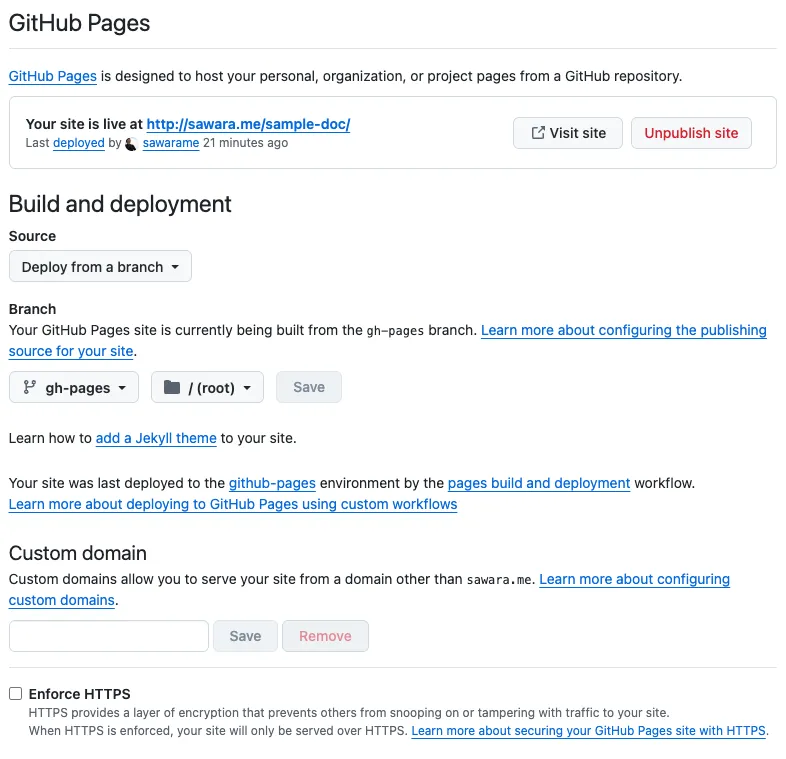

このサイト(sawara.me)はDocusaursで作成し、GitHub Pagesでホストしています。

オープンソースのDocusaurusとオンラインプラットフォームのGitHubを組み合わせることで、無料で簡単にサイトを公開することができます。

今回はDocusaurusとGitHub Pagesという機能を使ったサイトの公開方法について紹介します。

公式サイト： https://docusaurus.io/

<!-- truncate -->

### Docusaurusとは

Docusaurusは、Meta（旧Facebook）が開発しているオープンソースの静的サイトジェネレーターです。主にソフトウェアのドキュメントサイトを作成するために設計されていますが、ブログ機能やカスタムページ作成機能も充実しており、個人ブログやポートフォリオサイトとしても非常に優秀です。

Reactベースで構築されており、MarkdownやMDX（Markdownの中でReactコンポーネントを使える形式）を使って、素早く美しく、かつ高速なサイトを作成できるのが特徴です。

GitHub Pagesのドキュメント： https://docs.github.com/ja/pages

### GitHub Pagesとは

GitHub Pagesは、GitHubのリポジトリから直接Webサイトをホストできるサービスです。HTML、CSS、JavaScriptファイルをリポジトリにプッシュするだけで、無料でサイトを公開できます。

Docusaurusのような静的サイトジェネレーターとの相性が非常に良く、ビルドしたファイルをGitHub Pagesにデプロイすることで、サーバーの管理をすることなくサイトを運用できます。

### GitHubでリポジトリを作成

GitHubのアカウントを持っていない人はまずGitHubのアカウントを作成してください。

GitHubにログイン後ヘッダーの「+」ボタンから「New Repository」を選択して、リポジトリを作成します。



リポジトリとはプログラムのソースコード（ファイル）を管理する場所です。Docusaurusのプロジェクトファイルを管理するための場所を作るイメージです。

「Repository Name」を入力して、「Create repository」をクリックすれば作成完了です。



「Repository Name」を`<GitHubアカウント名>.github.io` という名前で作成すれば、そのまま `https://<GitHubアカウント名>.github.io` というURLで公開できるようになります。

今回私は「sample-doc」というリポジトリを作成しましたが、その場合でも `https://sawarame.github.io/sample-doc/` という形で公開することができます。

### Docusaurusインストール

次に、ローカルでDocusaurusのプロジェクトを作成し、GitHubにプッシュします。

ローカルのターミナルを開いて下記コマンドを実行し、Docusaurusのプロジェクトを作成します。

```bash
npx create-docusaurus@latest <リポジトリ名> classic --typescript
cd <リポジトリ名>
```

リポジトリ名のところは自身で作成したリポジトリ名に変更して下さい。

次にGitの初期化を行います。

```bash
# Gitの初期化とプッシュ
git init
git branch -M main
git add .
git commit -m "first commit"
git remote add origin git@github.com:<GitHubアカウント名>/<リポジトリ名>.git
git push -u origin main
```

こちらも自身のGitHubアカウント名・リポジトリ名に合わせて変更してください。

次にGitHub Pagesで公開するためのブランチを作成します。gh-pagesというブランチを作成します。

```bash
# デプロイ用のブランチ作成
git checkout -b gh-pages
git push --set-upstream origin gh-pages

# mainブランチに戻るのを忘れずに
git checkout main
```

### GitHub Pagesに公開

ローカルで作成したDocusaurusのプロジェクトの`docusaurus.config.ts` の設定を自身のサイトに合わせて修正します。

設定する項目は以下のとおりです。

- `url`: GitHub PagesのURL。独自ドメインを利用しない場合は `https://<GitHubアカウント名>.github.io` になります。
- `organizationName`: GitHubアカウント名
- `projectName`: リポジトリ名

こちらは私が修正した例です。  
https://github.com/sawarame/sample-doc/commit/154b4f11af943cdddc76833a047f90898479b407

`sample-doc` というリポジトリで作成したので、 `baseUrl` に `/sample-doc/` としていますが、 `<GitHubアカウント名>.github.io` というリポジトリ名で作成した場合は `/` のままでOKです。

設定が完了したら、以下のコマンドを実行してデプロイします。

```bash
yarn deploy
```

このコマンドを実行すると、Docusaurusがサイトをビルドし、その結果を自動的に `gh-pages` ブランチにプッシュしてくれます。

デプロイ完了後、GitHubのリポジトリの「Settings」>「Pages」を確認してください。「Build and deployment」の「Branch」が `gh-pages` に設定されていることを確認します。



数分待つと、上部に表示されているURLから公開されたサイトにアクセスできるようになります。

### おわりに

DocusaurusとGitHub Pagesを組み合わせることで、非常に手軽に、かつ高機能なドキュメントサイトやブログを公開することができました。

Markdownを書くだけでどんどんコンテンツを増やしていけるので、技術的な備忘録やプロジェクトの紹介にぜひ活用してみてください。