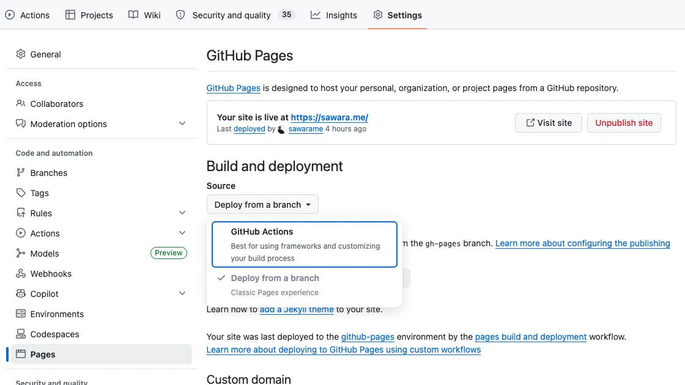
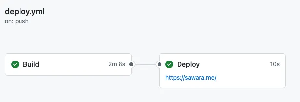

前回の記事では、Docusaurus で作成したサイトを GitHub Pages に手動でデプロイする方法を紹介しました。今回は、さらに一歩進んで **GitHub Actions を使い、コードを GitHub にプッシュするだけで自動的にデプロイされる仕組み** を構築します。

<!-- truncate -->

## 手順の概要

自動デプロイを実現するための流れは以下の通りです。

1. **GitHub リポジトリの設定変更**: デプロイの権限を GitHub Actions に与えます。
2. **ワークフローファイルの作成**: ビルドとデプロイの手順を記述した設定ファイルを作成します。
3. **動作確認**: コードをプッシュして、実際にサイトが更新されるか確認します。

---

## 1. GitHub リポジトリの設定変更

まず、GitHub Actions から GitHub Pages へ直接デプロイできるように設定を切り替えます。

1. GitHub リポジトリの **Settings** タブを開きます。
2. 左サイドメニューの **Pages** を選択します。
3. **Build and deployment** セクションにある **Source** を、デフォルトの `Deploy from a branch` から **GitHub Actions** に変更します。




これで、GitHub Actions 経由でサイトを更新する準備が整いました。

## 2. GitHub Actions のワークフローを作成する

次に、ビルドとデプロイの手順を定義する「ワークフローファイル」を作成します。リポジトリのルートディレクトリに `.github/workflows/deploy.yml` というファイルを作成し、以下の内容を記述します。

```yaml
name: Deploy to GitHub Pages

on:
  push:
    branches:
      - master # 一般的には main ですが、本プロジェクトでは master を使用しています
  workflow_dispatch:

permissions:
  contents: read
  pages: write
  id-token: write

concurrency:
  group: "pages"
  cancel-in-progress: true

jobs:
  build:
    name: Build
    runs-on: ubuntu-latest
    steps:
      - name: Checkout
        uses: actions/checkout@v4
        with:
          fetch-depth: 0

      - name: Setup Node
        uses: actions/setup-node@v4
        with:
          node-version: 24
          cache: 'yarn'

      - name: Install dependencies
        run: yarn install --frozen-lockfile

      - name: Build website
        run: yarn build

      - name: Upload artifact
        uses: actions/upload-pages-artifact@v3
        with:
          path: ./build

  deploy:
    name: Deploy
    runs-on: ubuntu-latest
    needs: build
    environment:
      name: github-pages
      url: ${{ steps.deployment.outputs.page_url }}
    steps:
      - name: Deploy to GitHub Pages
        id: deployment
        uses: actions/deploy-pages@v4
```

:::note
現在の GitHub のデフォルトブランチ名は `main` が一般的ですが、プロジェクトによっては `master` を継続して使用している場合があります。ご自身の環境に合わせて `branches` の指定を書き換えてください。
:::

### ワークフローの役割

- **Build ジョブ**: GitHub のサーバー上で Node.js 環境を構築し、`yarn build` を実行して公開用の静的ファイルを生成します。生成されたファイルは「アーティファクト」として一時保存されます。
- **Deploy ジョブ**: 保存されたアーティファクトを受け取り、GitHub Pages のサーバーへ直接デプロイします。

## 3. git push して動作を確認する

最後に、作成したワークフローファイルをリポジトリにプッシュして、動作を確認しましょう。

1. ターミナルで `git add .`、`git commit`、`git push` を行います。
2. GitHub リポジトリの **Actions** タブを開きます。
3. `Deploy to GitHub Pages` というワークフローが開始されていることを確認します。
4. 全てのジョブが緑色のチェックマーク（成功）になったら完了です。



実際に公開されているサイト（`https://<ユーザー名>.github.io/<リポジトリ名>/`）にアクセスし、変更が反映されていることを確認してください。

## まとめ

これで、コードをプッシュするだけでサイトが自動更新されるようになりました。デプロイの手間がゼロになるだけでなく、常にクリーンな環境でビルドが保証される安心感は大きいです。

手動でのデプロイ作業から解放され、より価値のある「執筆」や「開発」に集中できるようになるこの仕組み、ぜひ導入してみてください。
