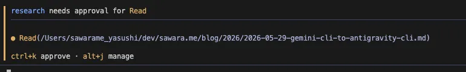
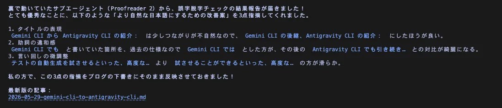
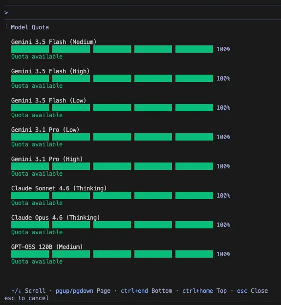
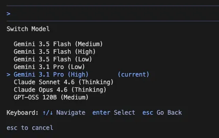

従来の **Gemini CLI** は、 2026年6月18日 をもってサポートおよびリクエストの受け付けが終了し、Googleの後継エージェントツールである **Antigravity CLI** （コマンド名： `agy` ）へ完全に統合されます。

本記事では、Macの Homebrew を使用したインストール手順、新旧ツールの比較、料金体系・クレジットモデルの変化について解説します。

<!-- truncate -->

---

### Antigravity CLI とは？

Googleは、開発者向けAIエコシステムを「Antigravity」ブランドへ統合しました。これに伴い、従来の Gemini CLI の後継として提供が開始されたのが **Antigravity CLI** です。

主な特徴は以下の通りです。

* **実行速度とレスポンスの向上**:
  従来の Gemini CLI は Node.js で構築されていましたが、Antigravity CLI は **Go 言語** で完全にゼロから書き直されました。これにより、メモリ消費量が削減され、ターミナル上での動作スピードが大幅に向上しています。
* **サブエージェント機能と安全な並行ワークフロー**:
  単一のチャット応答を行うだけでなく、裏側で複数のタスクや「サブエージェント」を非同期で並列実行する機能が搭載されています。対話画面内で **`/schedule`** や **`/goal`** コマンドで明示的にバックグラウンド処理を指示できるのはもちろん、**ユーザーの指示内容からAI自身が判断して自動でサブエージェントを立ち上げる**こともあります。
  特に、「元のコードを壊す恐れのある検証作業」を依頼した際などには、AIの判断で現在のディレクトリを直接書き換えるのではなく、背後で仮想的に「ブランチ（分岐）」したワークスペース上でサブエージェントに隔離して作業させます。これにより、本番環境を汚すことなく、裏側で大胆なコード変更やテストを安全に試させることが可能です。

<div className="text--center" style={{ margin: '2rem 0' }}>


<small style={{ display: 'block', marginTop: '-1rem', color: 'var(--ifm-color-emphasis-600)' }}>試しにAIにこの記事の誤字脱字確認を依頼したところ、サブエージェントからファイル読み込みの許可を求められ、</small>

</div>

<div className="text--center" style={{ margin: '2rem 0' }}>


<small style={{ display: 'block', marginTop: '-1rem', color: 'var(--ifm-color-emphasis-600)' }}>許可をすると、しばらくしたらメインAIに作業完了の報告が届いた</small>

</div>

---

### クレジット・料金体系の変化

Gemini CLI から Antigravity CLI への移行に伴い、認証方式の裏側と料金（クォータ）の管理モデルが大きく変更されました。

#### Gemini CLI 時代
Gemini CLI では Google アカウントによる OAuth 認証（ `gemini login` ）が採用されていました。この際、個人開発者向けの無料枠として、**「1日あたり1,000リクエスト、1分間あたり60リクエスト」** といった、API呼び出し回数ベースの制限が適用されていました。

#### Antigravity CLI 時代
Antigravity CLI でも引き続き Google アカウントの OAuth 認証を利用しますが、クォータの概念が「プラットフォーム全体での一元管理」へと移行しました。

料金プランおよびクォータは以下の3つのティアに分かれています。

1. **Free / Baseline Tier (無料枠)**:
   個人の Google アカウントで利用可能です。回数ベースではなく、**「週単位でリセットされるベースラインクォータ」** が自動的に付与されます。これには、Gemini 3.5 Flash や 3.1 Pro といったコアモデルへのアクセス、無制限のインラインコード補完（Tab補完）、ローカルツール実行権限が含まれます。
2. **Google AI Pro**:
   **5時間ごとにリフレッシュ** され、週上限のあるより高いレートリミットが提供される有料サブスクリプションプランです。クォータを使い切った場合でも、購入した「AIクレジット」を消費してシームレスに利用を継続できます。
3. **Google AI Ultra**:
   最も高いレートリミットと最優先のクォータ、そして一部のサードパーティ製外部モデルへのアクセス権が含まれる最上位プランです。

:::tip 現在の利用枠（クォータ）の確認方法
Antigravity CLI の対話画面内で **`/usage`** コマンドを実行すると、今週のベースラインクォータの残り状況や、AIクレジットの消費量などをリアルタイムで確認できます。
:::

<div className="text--center" style={{ margin: '2rem 0' }}>


<small style={{ display: 'block', marginTop: '-1rem', color: 'var(--ifm-color-emphasis-600)' }}>/usage コマンドの結果 0%になるとリフレッシュ時間になるまで使えなくなる</small>

</div>

<div className="text--center" style={{ margin: '2rem 0' }}>


<small style={{ display: 'block', marginTop: '-1rem', color: 'var(--ifm-color-emphasis-600)' }}>/model コマンドで使用するモデルを変更できる</small>

</div>

---

### インストールと起動（Mac環境）

Mac を使用している場合、パッケージ管理ツールの **Homebrew** を使用してワンコマンドで導入できます。従来必要だった Node.js などの実行環境の事前準備は不要です。

#### 1. CLI版とIDE版のインストール
ターミナルを開き、以下のコマンドを実行します。

```bash
brew install antigravity-cli
```

#### 2. 起動コマンド
インストールされるバイナリのパッケージ名は `antigravity-cli` ですが、実際にターミナルから呼び出すコマンド名は、短く最適化された **`agy`** となります。

```bash
agy
```

初回起動時は、Google アカウントによる OAuth 認証ページが自動的にブラウザで開きます。画面の指示に従って認証を完了させてください。

---

### Antigravity IDE との使い分け

Googleは GUI 開発環境として「Antigravity IDE」も提供しています。

```bash
# Antigravity IDE をインストール
brew install antigravity-ide
```

CLI（ `agy` ）との役割の使い分けは以下のようになります。

| 観点 | Antigravity CLI (`agy`) | Antigravity IDE |
| :--- | :--- | :--- |
| **主な用途** | ターミナル内での迅速な修正、スクリプト実行、自動化 | ビジュアルな画面設計、複数ファイルの横断デバッグ |
| **操作スタイル** | コマンドライン、対話インターフェース | GUIダッシュボード、統合エディタ |
| **強み** | 軽量・高速起動、CI/CD・自動化スクリプト連携 | 内蔵ブラウザによるUIプレビュー、視覚的デバッグ |
| **自動化連携** | `always-proceed` を用いたフルオート実行、ヘッドレス実行 | GUI上でのエージェントの挙動の監視と手動介入 |

両者は競合するものではなく、共通のバックエンドを利用しているため、「大がかりなUI構築や初期設計は IDE で行い、日々の細かなコード修正やGit操作は CLI から agy で行う」といった併用が最も効果的です。

---

### 知っておきたい便利なコマンド集

Antigravity CLI をより便利に使いこなすための、代表的な起動オプションと対話画面（チャット）内で使えるスラッシュコマンドをいくつか紹介します。

#### 起動オプション
* **`agy --continue` （または `-c`）**
  前回閉じた直前の会話セッションをそのまま復元して再開します。「昨日の続きから作業したい」という時に非常に便利です。
* **`agy --conversation <ID>`**
  特定の会話IDを指定して過去のコンテキストを復元します。

#### 対話画面でのスラッシュコマンド
チャット入力欄で `/` を入力することで実行できる特殊なコマンドです。

* **`/usage`** : 先述の通り、現在のトークン利用量や無料枠の残り状況を確認します。
* **`/help`** : 現在の環境で利用可能なスラッシュコマンドや設定方法の一覧を表示します。
* **`/schedule`** : 定期的なタスクやタイマーをバックグラウンドで予約します。「毎朝テストを走らせて結果をサマリして」といった使い方が可能です。
* **`/goal`** : 長時間かかる複雑なタスクをエージェントに任せ、「この目標が達成されるまで絶対に止まらないで」と指示を出せる強力な機能です。

---


### まとめ

Gemini CLI のサポート終了である **2026年6月18日** に向けて、早めの移行をおすすめします。
移行後は、まず対話画面内で `/help` コマンドを実行し、利用可能な新コマンド群を確認してみるのがおすすめです。

Go 言語化による快適な速度と、進化した非同期エージェントの自律動作を、ぜひ新しい Antigravity CLI で体験してみてください。
