開発プロセスにおいてAIにコード変更を指示する際、十分な調査や設計合意がないまま直接コードを書き換えると、意図しない変更や修正の手戻りが発生するリスクが高まります。このような課題を解決するために、Antigravity CLI には、実装前の「計画（Planning）」と成果物の「視覚的な管理（Artifact）」を組み合わせた開発フローが用意されています。

本記事では、対話画面から実行できる **`/planning`** コマンドと **`Artifact（成果物）`** 機能の役割を整理し、実際にプロジェクトへ単体テストを導入したプロセスをもとに、AIと開発者の間における認識の齟齬を防ぐアプローチについて解説します。

<!-- truncate -->

---

### 各コマンドと機能の役割

#### `/planning` コマンド：実装前の設計と合意形成

**`/planning`** は、Antigravity CLI の対話画面内で実行する特別なスラッシュコマンドです。このコマンドを入力すると、一時的に計画モードに切り替わり、直接のコード修正を行わずに以下の調査と設計を行います。

- **コードベースの解析**: 変更に関連する既存のソースコードや依存ライブラリ、プロジェクトの設定を読み込みます。
- **実装方針の策定**: 追加または修正が必要なファイルの一覧、およびその実装手順を整理します。
- **検証方法の定義**: 実装後に正常に動作するかを確認するための自動テストコマンドや、手動での確認手順をまとめます。
- **計画書の提示**: 以上の内容をまとめた「実装計画書」を作成し、開発者に提示します。

開発者はこの計画書をレビューし、方針に問題がないかを確認した上で実装の実行を承認（Proceed）します。これにより、事前に開発者とAIの間で設計や手順のすり合わせができ、実装に入ってからの認識の齟齬を防ぐことができました。

#### Artifact（成果物）機能：構造化された情報の独立管理

**`Artifact`** は、チャットの会話履歴とは独立したドキュメントやファイルとして情報を管理・提示する機能です。

通常、AI との対話で長いコードやドキュメントを出力させると、チャット画面が埋まり、過去のやり取りをスクロールして確認することが難しくなります。 Artifact 機能を利用すると、計画書（ `implementation_plan.md` ）やタスクリスト（ `task.md` ）、完成した成果物のドキュメント（ `walkthrough.md` ）が独立した画面や別ファイルとして出力されます。

これにより、以下のメリットが得られます。

- **高い視認性**: チャットの対話履歴を汚さず、最新の成果物だけを整理された形で確認できます。
- **シームレスな操作**: 提示された計画書に対して「承認」ボタンを押すだけで、次の実装フェーズへ自動で移行します。
- **履歴の更新**: 計画やタスクが進行するにつれて、同じ Artifact の内容が随時書き換えられ、最新状態が維持されます。

---

### 実践：単体テストの追加

ここからは、実際にこの sawara.me のツール集にテストフレームワーク（ **`Vitest`** ）を導入し、単体テストを追加する開発フローを例に、具体的な流れを解説します。

#### 計画の作成

まず、Antigravity CLI の対話画面で以下のように指示し、 **`/planning`** コマンドを実行してプランニングモードに移行します。

<BlogImageWrapper caption="/planningコマンドで、プランニングモードに移行する">
  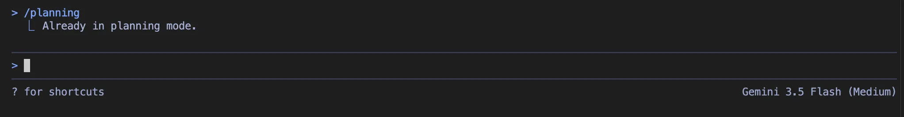
</BlogImageWrapper>

プランニングモードに移行後、実装したい内容のプロンプトを入力します。

```text
このプロジェクトのツール集に単体テストを実装してください。
```

最初はあえて、大まかに指示を出してみました。

指示を入力すると、プロジェクトの `package.json` や既存のコードが解析され、 `implementation_plan.md` が Artifact として新規作成されます。

<BlogImageWrapper caption="implementation_plan.mdというArtifactが作成された">
  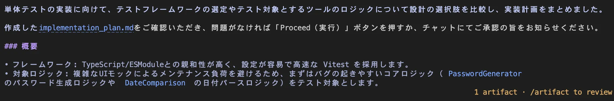
</BlogImageWrapper>

内容を確認するために `/artifact` コマンドを実行し、`implementation_plan.md` の `open` を選択して中身を確認します。

<BlogImageWrapper caption="/artifactコマンドの結果からopenを選択">
  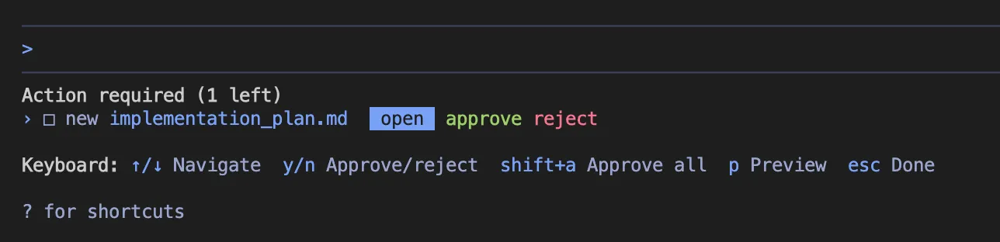
</BlogImageWrapper>

確認すると、テスト対象が3つのコンポーネントのみに限定されていたため、一度 `reject` して指示を出し直すことにしました。

<BlogImageWrapper caption="implementation_plan.mdの中身">
  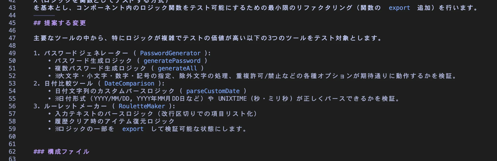
</BlogImageWrapper>

`reject` を選択すると理由を入力するよう求められるため、「5. Write-in...」を選択し、以下の具体的な要望を入力します。

<BlogImageWrapper caption="reject理由選択">
  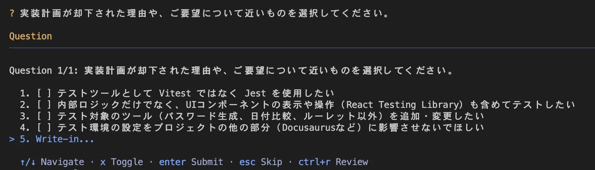
</BlogImageWrapper>

```text
ツール集で定義されているすべての機能に対して単体テストを実装してください。
```

指示を再入力すると、再度 `implementation_plan.md` が作成されます。

<BlogImageWrapper caption="reject内容から再度implementation_plan.mdが作成された">
  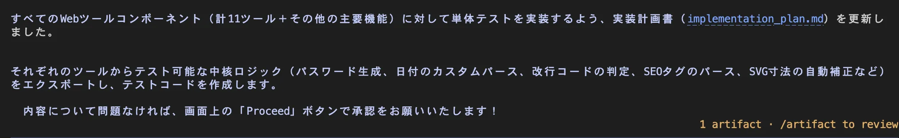
</BlogImageWrapper>

再び `/artifact` コマンドを実行し、中身を確認します。

<BlogImageWrapper caption="再作成されたimplementation_plan.mdの中身">
  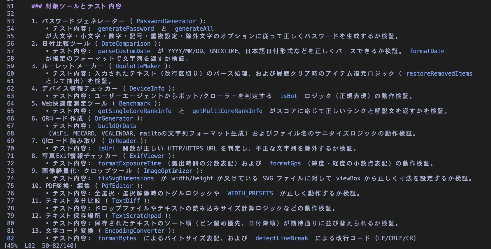
</BlogImageWrapper>

再作成された計画書では、すべてのツールが単体テストの作成対象に含まれていることが確認できました。テスト内容についてもさらに細かく調整することは可能ですが、今回はこの内容で進めることにします。

改めて `approve` を選択します。

<BlogImageWrapper caption="今度はapproveを選択">
  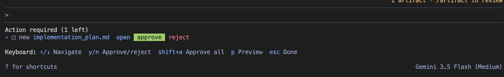
</BlogImageWrapper>

承認後、 `task.md` が作成されます。バックグラウンドで処理が実行されている間も、 `/artifact` コマンドで進捗を確認できます。

<BlogImageWrapper caption="バックグラウンド処理の実行中でもコマンドの入力が可能">
  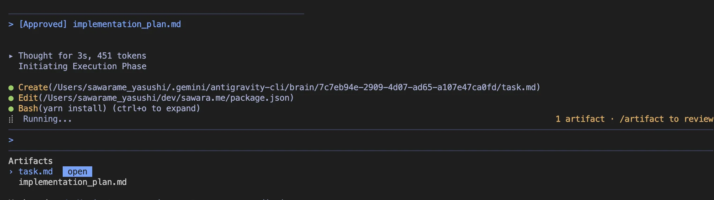
</BlogImageWrapper>

`task.md` の中身はチェックリストになっており、作業が完了したタスクには自動でチェックが入っていきます。

<BlogImageWrapper caption="task.mdの中身">
  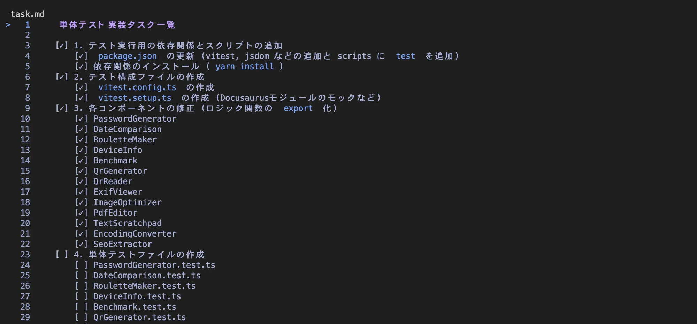
</BlogImageWrapper>

※チェックリストを表示したままにしておいても自動で更新されないため、一度閉じてから再度開き直す必要があります。

必要なパッケージ（ `vitest` など）のインストールやテストコードの実装、 `package.json` へのテストスクリプトの追加など、すべての作業が完了すると、 `walkthrough.md` という最終的な変更内容と検証結果を要約した Artifact が作成されます。

<BlogImageWrapper caption="作業完了後walkthrough.mdが作成される">
  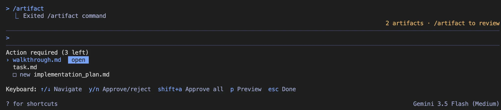
</BlogImageWrapper>

<BlogImageWrapper caption="walkthrough.mdの中身">
  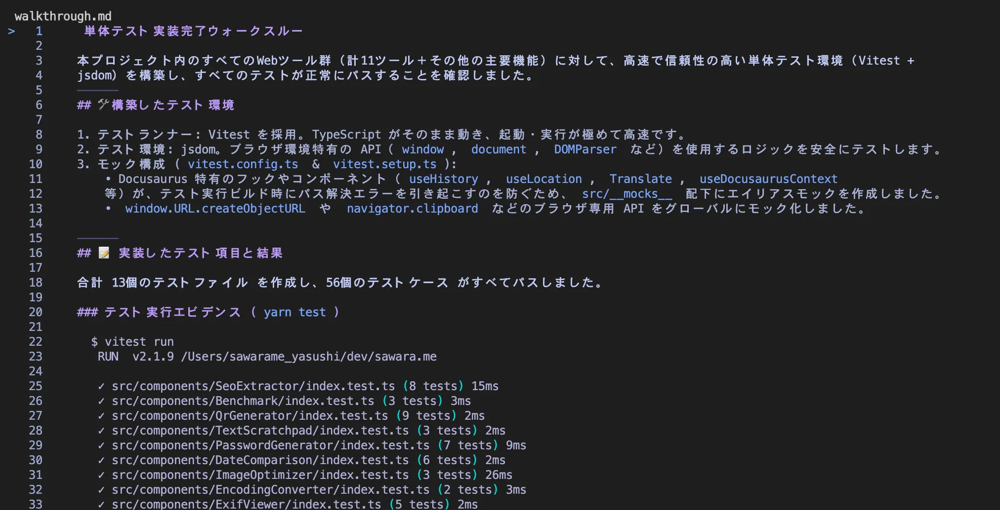
</BlogImageWrapper>

---

### 結論

Antigravity CLI の **`/planning`** コマンドと **`Artifact`** 機能を組み合わせることで、以下のステップに沿って安全に開発を進めることができました。

1. 実装前に変更方針の全体像を把握する
2. 会話とは独立したドキュメントでタスクと変更コードを整理する
3. 検証結果をレポート形式で確認する

これにより、単にコードを自動生成するだけでなく、事前にどのような変更を行うかをすり合わせることで、開発者とAIの間における認識の齟齬をなくすことができました。大規模な機能追加や、今回のようなテストフレームワークの導入時には、まず対話画面で **`/planning`** を実行して計画から着手することが有効であると感じました。
