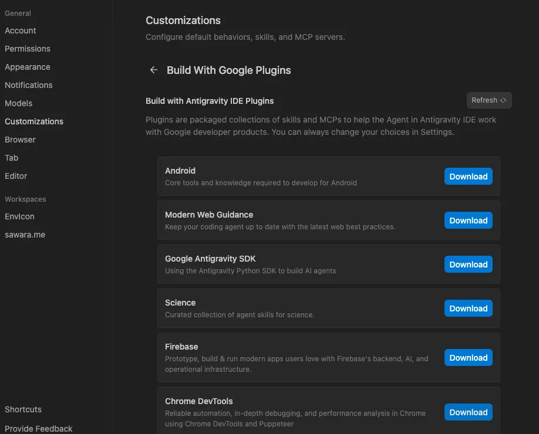
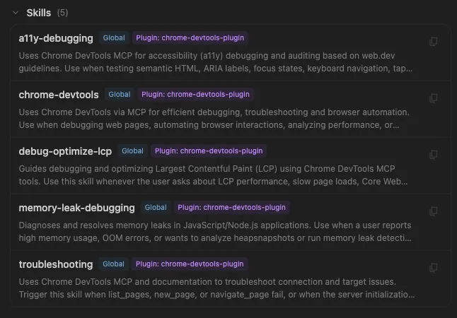
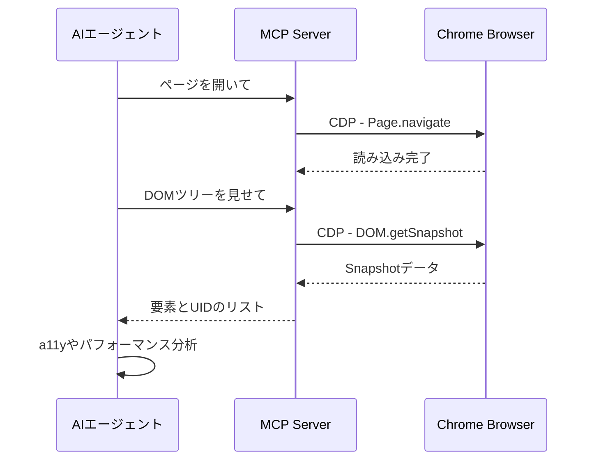
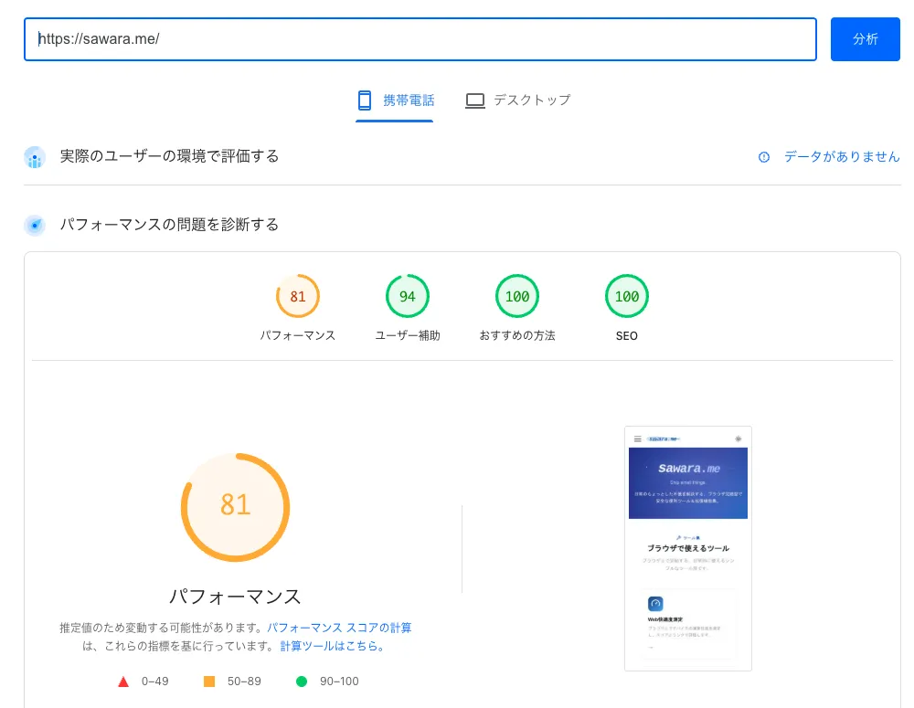
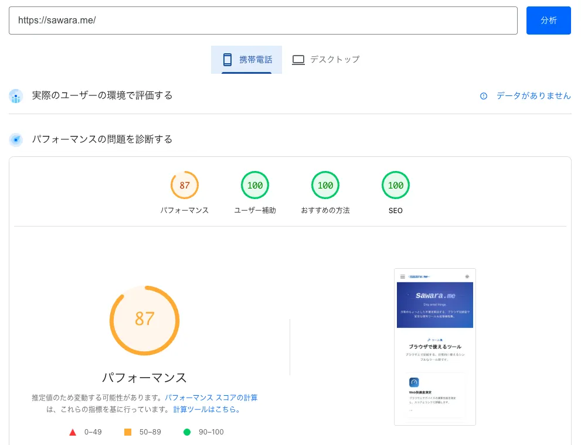
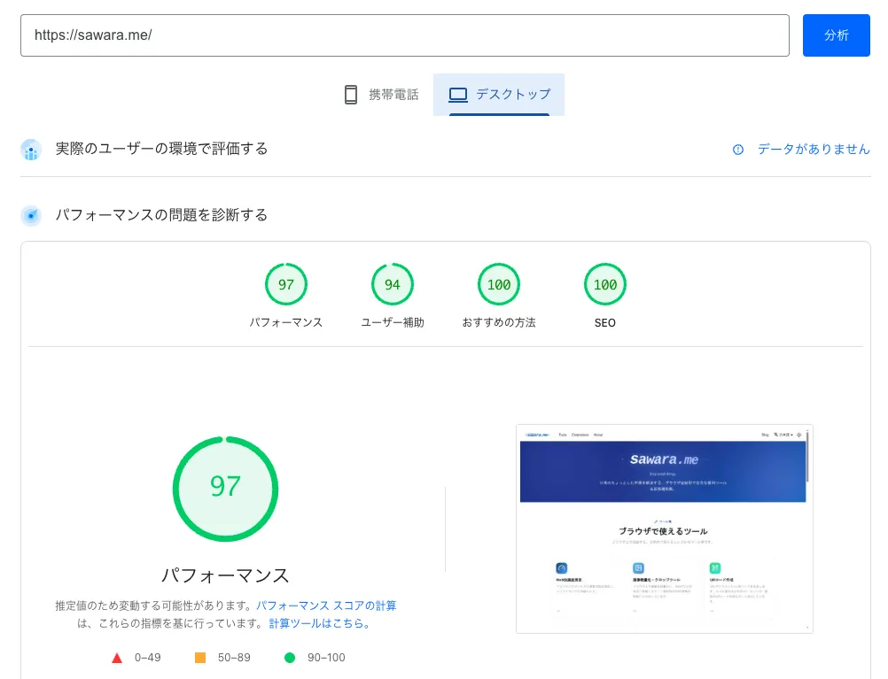
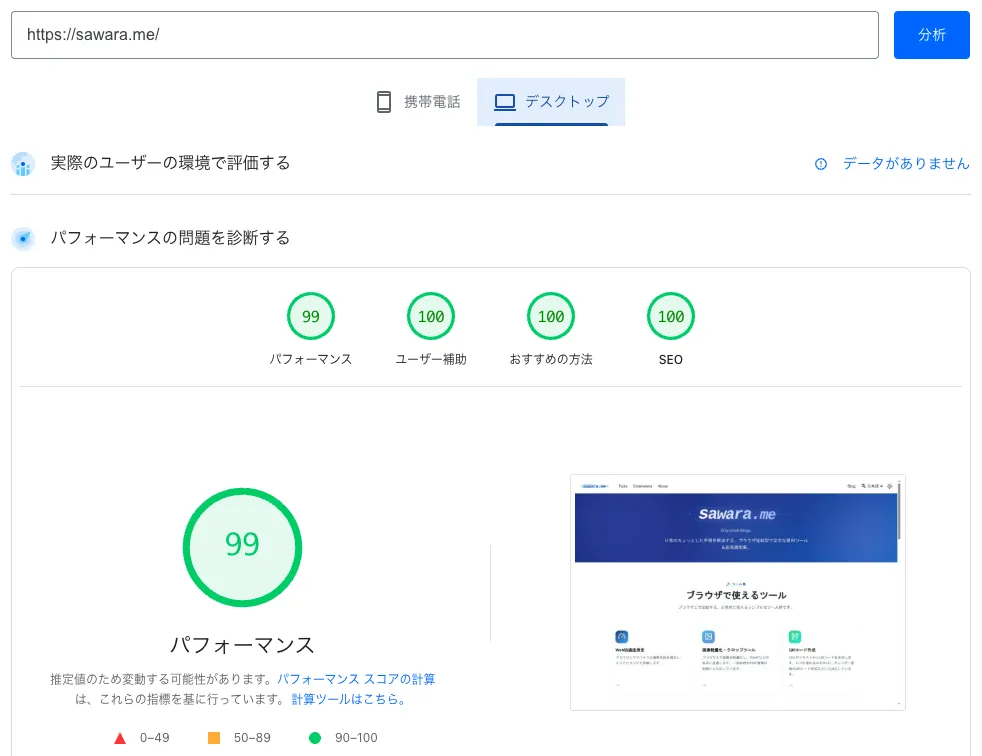

AIエージェントにコーディングだけでなく、ブラウザの操作やデバッグ作業まで任せられたら便利だと思いませんか？
Antigravity環境では、強力なプラグイン機能を活用することで、まさにそんな「自動検証ワークフロー」を簡単に実現することができます。

本記事では、Antigravity環境に「Chrome DevTools プラグイン」を導入し、AIエージェントにWebサイトのパフォーマンス改善（LCP）やアクセシビリティ（a11y）診断、メモリリークの特定を自動で行わせる実践的な方法について解説します。また、プラグインの裏側で活用されている技術「MCP（Model Context Protocol）」の仕組みについても触れていきます。

<!-- truncate -->

## 1. プラグインのインストール方法

Antigravity IDEでChrome DevToolsを活用するには、専用のプラグインをインストールする必要があります。
現状、プラグインのインストールはエディタのUIから行うのが最も簡単で確実です。

**インストール手順:**
1. 「Cmd + ,」でAntigravityの設定画面を開く
2. 左のメニューから「Customizations」を選択
3. 一番下の「Build With Google Plugins」セクションの「Customize」ボタンをクリック
4. 「Chrome DevTools」の横にある「Download」ボタンをクリックしてインストール

インストールが完了すると、所定のディレクトリ（`~/.gemini/config/plugins/`）にファイルが配置され、システムに自動的に読み込まれます。特別なターミナル操作やコマンド入力は不要で、すぐにチャットから利用を開始できます。

<BlogImageWrapper caption="設定画面から、Chrome DevTools プラグインをインストールする">
  
</BlogImageWrapper>

<BlogImageWrapper caption="インストール完了後、プラグインが有効になり、スキルが使用できるようになる">
  
</BlogImageWrapper>

## 2. プラグインの裏側で動く「MCP」の仕組み

プラグインを有効にすると、AIエージェントは「Chrome DevTools Protocol (CDP)」を介して直接Chromeブラウザを操作できるようになります。
この連携を実現しているのが **MCP (Model Context Protocol)** です。

エージェントがブラウザの情報を取得する際の流れは以下のようになります。

エージェントはブラウザの画面をただ見ているわけではなく、`take_snapshot` というツールを使ってページの裏側にある完全なDOM構造（要素ごとのUID）やアクセシビリティツリーを読み取り、論理的にページを検証しています。

:::note 実際の動作画面について
エージェントがブラウザを検証する際、ユーザーの画面上にChromeのウィンドウが立ち上がって動く様子が見えるわけではありません。基本的にはユーザーの作業を邪魔しないよう、バックグラウンド（ヘッドレスモード）でChromeが起動し、裏側で通信が行われます。
また、後述する「a11y診断」のような特定のタスクにおいては、エージェントが自律的に「CDPを直接叩くより `Lighthouse` のCLIを使った方が正確で早い」と判断し、最適なツールを自動選択して実行することもあります。
:::

## 3. プラグインで有効になる5つの専用スキル

プラグインをインストールすると、エージェントはMCPを通じてブラウザを操作する力だけでなく、目的に応じた5つのスキルを使えるようになります。エージェントはユーザーからの依頼内容に応じて、以下のスキルを自律的に使い分けます。

- **`chrome-devtools` (基本操作)**
  ページ遷移やクリック操作、DOM構造の取得など、ブラウザ操作とデバッグ全般のベースとなる汎用スキルです。
- **`a11y-debugging` (アクセシビリティ監査)**
  Web.devのガイドラインに基づき、適切なARIAラベルやコントラスト比、キーボードナビゲーションなどのアクセシビリティ問題を専門的に監査・修正提案します。
- **`debug-optimize-lcp` (パフォーマンス改善)**
  ページの読み込み速度の重要指標である「LCP (Largest Contentful Paint)」のボトルネックを特定し、最適化のためのガイドを行います。
- **`memory-leak-debugging` (メモリリーク診断)**
  Heap Snapshotを利用して、SPAなどで発生しがちなJavaScriptの厄介なメモリリークを診断し、原因となるコンポーネントを特定します。
- **`troubleshooting` (トラブルシューティング)**
  ページが開けない、接続が切れたといった、MCPサーバーやブラウザ操作そのもののトラブルを自己解決するための補助スキルです。

## 4. 具体的な実践例（AIへの指示の出し方）

実際にエディタのチャット欄でAIエージェントに指示を出し、自動デバッグを行わせるプロンプトの例を3つ紹介します。

### 実践例A：a11y（アクセシビリティ）の自動診断
Webサイトがアクセシビリティの基準（適切なARIAラベル、コントラスト比、キーボードナビゲーションなど）を満たしているか、エージェントにチェックさせます。

> **プロンプト例:**
> 「現在のローカルサーバー（ `http://localhost:3000` ）を開いて、トップページのボタンやフォームが a11y の基準を満たしているかチェックし、問題があれば修正案を出して」

### 実践例B：LCP（Largest Contentful Paint）のボトルネック特定
ページの読み込み速度の重要指標であるLCPが低下している場合、その原因（レンダリングブロック、重い画像など）を特定させます。

> **プロンプト例:**
> 「このページのLCPのスコアが悪い原因をデバッグして。画像やスクリプトの読み込み順序を確認し、LCPを最適化するための具体的なコードの修正案を教えて」

### 実践例C：JavaScriptのメモリリーク調査
SPA（Single Page Application）などで発生しがちなメモリリークを、Heap Snapshotを取って分析させます。

> **プロンプト例:**
> 「アプリを操作しているとメモリ使用量が増え続けています。Chrome DevToolsを使ってHeap Snapshotを取得し、メモリリークが発生しているコンポーネントを特定して」

### 実践例D：AI主導の自律型E2Eテスト（動作確認）
従来のE2Eテスト（PlaywrightやCypressなど）のように手動でテストコードを書かなくても、エージェントに「ユーザーの視点で操作して」と指示するだけで、柔軟な動作確認が可能です。

> **プロンプト例:**
> 「`http://localhost:3000` のお問い合わせフォームを開き、ダミーの情報を入力して送信ボタンを押すまでの一連の流れをテストして。もし途中でエラーが出たり、ボタンが押せなかったら原因を教えて」

UIのIDや構造が多少変わっても、AIが画面全体の構造（DOM）を読み取って「送信ボタンはこれだな」と文脈から判断してクリックしてくれるため、テストコードが壊れにくい（Flakyになりにくい）E2Eテストができます。

## 5. SEO向上に直結する大きなメリット

このプラグインで提供される `a11y-debugging` や `debug-optimize-lcp` といったスキルは、Googleが提唱する「web.dev」のガイドラインや「Core Web Vitals」の基準に強く準拠するように設計されています。

そのため、エージェントの指摘に従ってLCP（Largest Contentful Paint）を最適化したり、アクセシビリティの問題（不適切なARIAラベルやコントラスト比など）を修正することは、単にサイトの使い勝手を良くするだけでなく、Googleの検索エンジンからの評価（SEOスコア）を向上させることに直結します。

SEOやパフォーマンスの改善は専門的な知識が必要で手間がかかる分野ですが、AIエージェントに「Googleの基準に沿ってチェックして」と投げるだけで的確なSEO対策の第一歩を踏み出せるのは、このプラグインならではの大きな強みと言えます。

試しにこのサイトで改善前後の状態をLighthouseで計測してみました。結果として、スマートフォンのパフォーマンススコアは81から87へ、PCのスコアは97から99へと改善がみられました。

<BlogImageWrapper caption="改善前のLighthouseの計測結果（スマホ）">
  
</BlogImageWrapper>

<BlogImageWrapper caption="改善後のLighthouseの計測結果（スマホ）">
  
</BlogImageWrapper>

<BlogImageWrapper caption="改善前のLighthouseの計測結果（PC）">
  
</BlogImageWrapper>

<BlogImageWrapper caption="改善後のLighthouseの計測結果（PC）">
  
</BlogImageWrapper>

## まとめ：AIにブラウザデバッグを任せるメリット

Chrome DevTools プラグインを利用することで、原因の特定が難しいエラーのデバッグ作業や、時間のかかるパフォーマンスの改善調査をAIエージェントに一任できるようになり、日々の開発における負担が劇的に軽減されます。
このワークフローを取り入れることで

1. **定型検証タスクの自動化**: LCPやa11yといった「毎回チェックすべき項目」を自動化し、本質的な開発に集中できる。
2. **SEOスコアへの直接的な貢献**: Google基準（Core Web Vitals等）に準拠した改善案を提示してくれるため、対応がそのまま強力なSEO対策になる。
3. **柔軟で壊れにくいE2Eテスト**: AIが画面を文脈で解釈するため、多少のUI変更にも耐えられる「壊れにくい」自律的な動作確認が可能になる。
4. **高度なトラブルシューティング**: メモリリーク調査のような専門知識が必要なバグ調査も、エージェントが自律的に解析して特定してくれる。

といったメリットが得られます。

このように、パフォーマンス測定や動作確認といった「日々の定常作業」とエージェントは非常に相性が良いため、開発ワークフローにも取り入れることをおすすめします！
