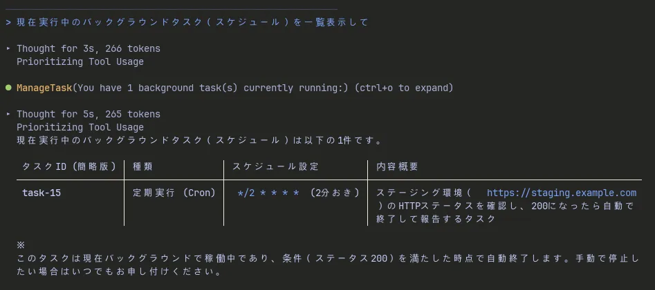
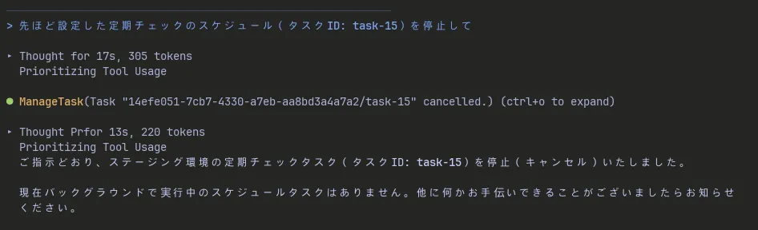

Antigravity CLIでは、ビルド処理やテストの実行など、時間のかかるタスクをAIエージェントに依頼することがよくあります。しかし、通常の同期処理では、タスクが完了するまでエージェントの応答がブロックされてしまい、その間他の指示を出すことができません。

このような非同期タスクの監視や定期実行を効率化するために用意されているのが、Antigravity CLIのスケジュール機能です。本記事では、**普段のチャット指示を通じた非同期タスク監視の基本ワークフロー**と、エンジニア向けの明示的なパラメータ制御について解説します。

<!-- truncate -->

## スケジュール機能が必要とされる背景

AIエージェントを活用した開発において、時間がかかる処理をバックグラウンドタスクとして実行させるケースが増えています。

例えば、数分かかるE2Eテストやライブラリのビルド処理をバックグラウンドに送った場合、処理結果を確認するためには人間が手動でログを確認するか、エージェントに定期的に状況を問い合わせる必要がありました。

Antigravityのスケジュール機能を活用することで、エージェント自身に「一定時間後」や「一定間隔」でバックグラウンド処理のステータスを確認させることが可能になり、開発者は並行して別の作業に集中できるようになります。

## 非同期タスク監視の基本ワークフロー

Antigravity CLIでは、特別なコマンド構文を意識しなくても、**普段のチャット指示の中に条件を添える**ことで、エージェントにスケジュールタスクを設定させることができます。

### 実践例1：一定時間後のフォローアップ（ワンショットタイマー）

時間がかかるビルドやテストをバックグラウンドで実行させつつ、「しばらく経ったら確認して」と伝えるパターンです。

> **チャットでの指示例:**
> 「バックグラウンドでテストを実行して。1分後にテストが完了したか確認し、結果をまとめて報告してください」

指示を受けたエージェントは自律的にタイマーをセットし、裏側で監視を行います。
さらにこの機能には、**非同期処理に連動したスマートな自動キャンセル挙動**が備わっています。タイマー待機中にテストが早期完了して通知テキストが届いた場合、予約されていたタイマーはサイレントに自動解除されます。「処理が長引いた場合のみエージェントを起こして確認させる」という無駄のない監視がシンプルなやり取りだけで成立します。

### 実践例2：デプロイ状態の定期チェック（定期実行）

ステージング環境へのデプロイ作業後、サーバーが正常にレスポンスを返すようになるまで監視させるパターンです。

> **チャットでの指示例:**
> 「ステージング環境（ https://staging.example.com ）のステータスを2分おきにチェックして。HTTPステータスが200になったら確認を終了して報告してください」

エージェントは指示を文脈から解釈し、定期的にアクセスを行うバックグラウンドジョブを裏で立ち上げます。条件を満たした時点でジョブ自体も自律的に終了させてくれます。

## パラメータによる明示的なスケジュール指定

会話テキストからの推論では意図した間隔にならない場合や、ジョブの上限値を厳密に制御したいエンジニア向けに、`/schedule` コマンド構文とパラメータを用いて直接指示する方法も用意されています。

裏側で動作するスケジュール機能には、以下の4つの引数が定義されています。

* `DurationSeconds`: ワンショットタイマーの待機時間（秒数）。最大900秒（15分）まで指定可能。
* `CronExpression`: 定期実行時のスケジュールを指定する標準的な5フィールドのCron式。
* `MaxIterations`: 定期実行（Cron）がトリガーされる最大回数（オプション）。
* `Prompt`: タイマー発火時やCron実行時にエージェントへ送信される指示テキスト（必須）。

※ `DurationSeconds` と `CronExpression` は排他的（どちらか一方のみ指定）となります。

#### コマンドでの入力例

```text
/schedule CronExpression="*/5 * * * *" MaxIterations=3 Prompt="デプロイのステータスを確認してください"
```

自然言語の指示で意図した間隔にならない場合や、無限実行を防ぐために `MaxIterations` を厳密に指定したいケースなどで有効です。

## スケジュールタスクの管理方法

裏側で登録されたスケジュールジョブは、エージェント内部でバックグラウンドタスクとして管理されています。
これらを管理（状態確認や途中停止）する際も、**チャット上でそのままエージェントに依頼する**ことで安全に操作できます。

* **一覧表示**: 「現在実行中のバックグラウンドタスク（スケジュール）を一覧表示して」と伝える
* **ジョブの停止**: 「先ほど設定した定期チェックのスケジュール（タスクID: XXXXX）を停止して」と依頼する

<BlogImageWrapper caption="スケジュールの一覧表示">
  
</BlogImageWrapper>

<BlogImageWrapper caption="スケジュールを停止">
  
</BlogImageWrapper>

### 運用上の注意点

スケジュール機能を利用する際は、以下の点に留意してください。

* **ポーリング間隔の設計**: 数秒おきなどの極端に短いインターバルで外部URLや重い処理を叩くと、サーバーへの負荷やAPIレート制限に引っかかる可能性があります。通常は数分おきの設定が適しています。
* **セッションスコープ**: スケジュールされたタスクは、現在のCLIセッション内でのみ有効です。セッションを終了（ターミナルを閉じる等）するとタスクも破棄されるため、日をまたぐような長期的なジョブ実行には適していません。

## まとめ

Antigravity CLIのスケジュール機能は、日常的なチャットを通じたタスク委譲と、必要に応じたパラメータ制御を柔軟に組み合わせられる実用的な機能です。

主なメリットは以下の通りです。

* **シンプルな導入**: 普段のチャットベースのやり取りの中に自然に監視処理を組み込める
* **スマートな監視制御**: 早期完了時の自動キャンセル処理により、エージェントリソースを無駄に消費しない
* **確実なエンジニアリング**: 必要に応じてCron式や試行回数上限を直接パラメータで指定することも可能

バックグラウンド実行やサブエージェントによる並行処理を行う際は、ぜひこのスケジュール機能を組み合わせてみてください。
