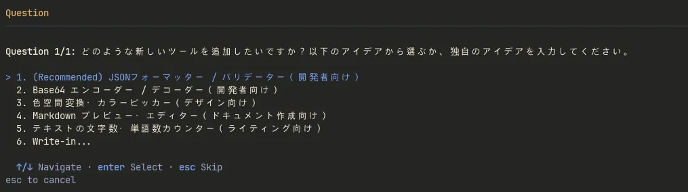
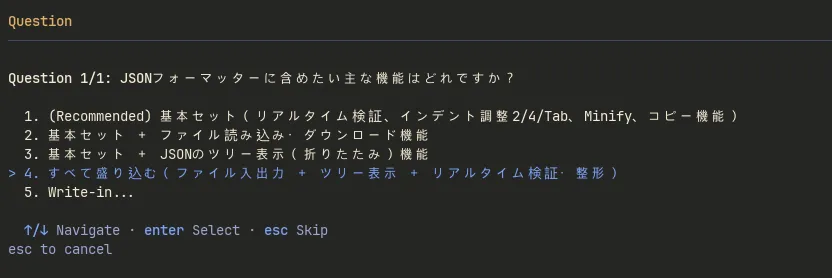
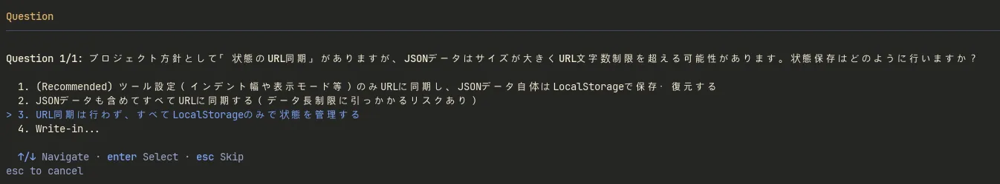
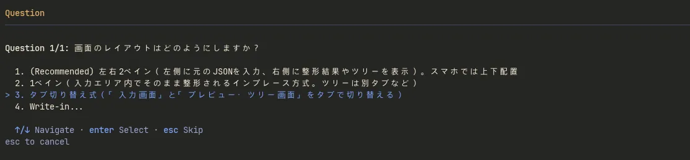
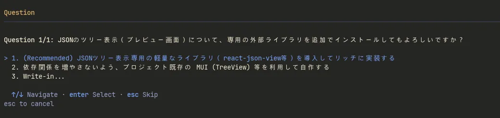
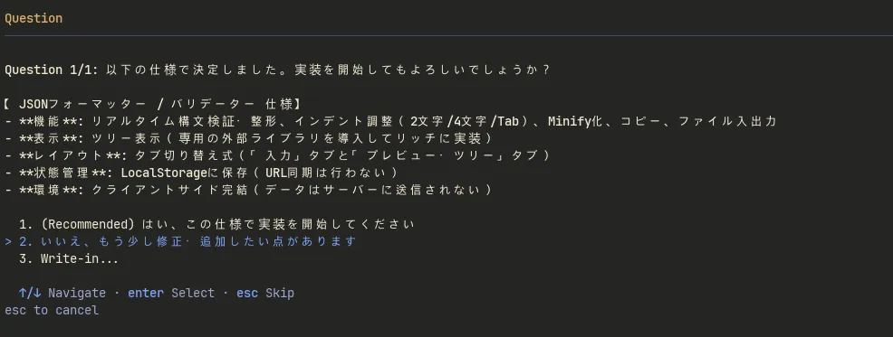
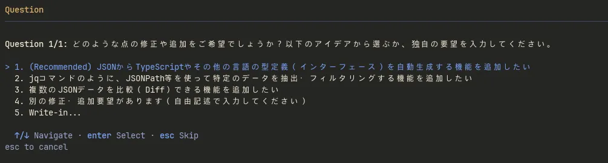
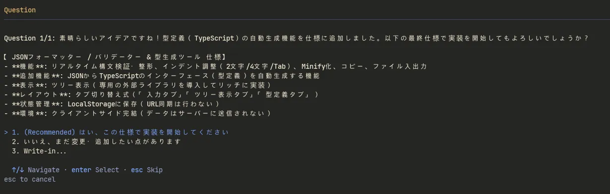

AIエージェントに自律的なコーディングを依頼する際、もっとも高いハードルとなるのが「要件定義（プロンプトの作成）」です。アイデアは頭にあっても、それを抜け漏れのない仕様書に落とし込むのは人間にとって骨の折れる作業です。

Antigravity CLI には、この問題を解決する強力なスラッシュコマンド `/grill-me` が搭載されています。人間が仕様を書き出すのではなく、AI側から人間に「質問攻め（逆インタビュー）」を行わせることで、曖昧なアイデアから仕様を固め、そのまま実装（自動コーディング）までを一気通貫で完遂させる機能です。

本記事では、この `/grill-me` を使って実際に当サイト（sawara.me）の新しいツール機能を追加した際の実践ログを通じ、AIによる要件定義の具体的なワークフローを紹介します。

<!-- truncate -->

## STEP 1: アイデア出し

新しいWebツールを追加しようと思い立ったものの、具体的なアイデアが固まっていなかったため、まずは `/grill-me` を起動して「ツール一覧に機能を追加してみたい」とだけ伝えました。

<small style={{ display: 'block', marginTop: '-1rem', color: 'var(--ifm-color-emphasis-600)' }}>AIからの初期提案（JSONフォーマッターやBase64エンコーダーなど）</small>

すると、AI側から「プロジェクトのコンセプトに合いそうなツール候補」がいくつか提案されました。今回は、推奨された「JSONフォーマッター / バリデーター」を作成対象として選択しました。

## STEP 2: 要件の深掘り

ツールの大枠が決まると、AIは即座に「それを実装するために決めなければならない技術的仕様」を洗い出し、ひとつずつ選択式で質問してきます。

<small style={{ display: 'block', marginTop: '-1rem', color: 'var(--ifm-color-emphasis-600)' }}>搭載する機能の取捨選択（ファイル入出力やツリー表示など）</small>

次に、プロジェクトの既存ルール（状態のURL同期）を踏まえた仕様の確認がありました。

<small style={{ display: 'block', marginTop: '-1rem', color: 'var(--ifm-color-emphasis-600)' }}>URL文字数制限への懸念と代替案（LocalStorage管理）の提示</small>

他のツールでは入力したパラメーターをURLに反映して、そのURLをブックマークすれば、同じ入力状態を復元できるようにしています。
このルールを参考にAIが先回りして「JSONデータはサイズが大きくURL文字数制限を超えるリスクがある」という技術的懸念事項を提示してきました。
今回はJSONデータをURLに同期する必要はないので、「すべてLocalStorageのみで管理する」を選択しました。

<small style={{ display: 'block', marginTop: '-1rem', color: 'var(--ifm-color-emphasis-600)' }}>レイアウト方針の決定（タブ切り替え式）</small>

<small style={{ display: 'block', marginTop: '-1rem', color: 'var(--ifm-color-emphasis-600)' }}>外部ライブラリ（react-json-view等）導入の許可確認</small>

その後も、UIレイアウト（タブ式）や、パッケージ依存関係を増やすことへの許可（`react-json-view` 等の導入可否）など、実装に入る前に確認が必要な事項を確認していきます。

人間が仕様書に書く際に落としがちな箇所をAIが的確にフォローしてくれる印象です。

## STEP 3: 仕様変更にも対応

すべての質問に回答すると、AIはこれまでの対話をまとめ、最終的な「仕様書（要件定義）」を提示してきます。

<small style={{ display: 'block', marginTop: '-1rem', color: 'var(--ifm-color-emphasis-600)' }}>要件定義のサマリ提示と実装開始の確認</small>

通常であればここで「はい」と答えて実装を開始させますが、今回は「いいえ、まだ変更・追加したい点があります」を選択してみました。

<small style={{ display: 'block', marginTop: '-1rem', color: 'var(--ifm-color-emphasis-600)' }}>型定義生成など、機能追加の提案</small>

すると、AI側から「JSONからTypeScriptの型定義を自動生成する機能を追加したい」という追加アイデアが選択肢として提示されたため、この提案を採用することにしました。
これにより、TypeScript型定義の自動生成機能（`json-to-ts` の活用など）を含む新しいアプローチが取り込まれ、仕様書全体が再構築されました。

<small style={{ display: 'block', marginTop: '-1rem', color: 'var(--ifm-color-emphasis-600)' }}>追加要件を取り込んだ最終仕様の確定</small>

このように、要件定義の最中に発生した仕様変更であっても、会話の流れを維持したまま自然に仕様全体へと反映・調整させることができました。

## STEP 4: 仕様確定から自動コーディングへ

最終仕様に合意して「はい、この仕様で実装を開始してください」を選択すると、AIは確定した要件をもとに即座にコーディングフェーズへと移行します。
人間が書いた曖昧なプロンプトではなく、AI自身が質問を通じて納得するまで固めた「完璧な仕様書」をベースに実装が進むため、手戻りや設計の破綻がほとんど発生しません。

実際にこのワークフローを経て、AIに完全自動で作成してもらったツールがこちらです。

* **[JSONフォーマッター ＆ バリデーター](/tools/json-formatter)**
  （リアルタイム整形からTypeScriptの型定義生成まで、すべてブラウザ上で完結します）

## まとめ

本記事では、Antigravity CLI の `/grill-me` コマンドを用いた要件定義のワークフローを紹介しました。

* **人間の負担軽減**: 白紙からプロンプトを書く必要がなくなり、AIの質問に答えていくだけで要件がまとまる。
* **技術的懸念の先回り**: 人間が見落としがちなエラー要因（データ長の超過や依存関係の追加など）をAIが事前にチェックしてくれる。
* **柔軟な仕様変更**: 途中で新しいアイデアを思いついても、対話を通じて自然に設計をアップデートできる。

仕様書を頑張って書いてからAIに「コードを書いて」と依頼するのではなく、まずは `/grill-me` で要件を徹底的に壁打ちさせることで、設計から実装までを一気通貫で任せられる高品質な自動コーディングを実践できると感じました。
