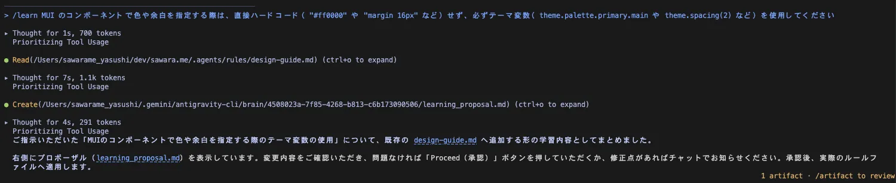
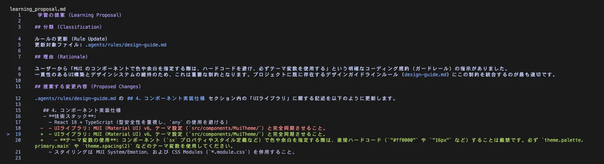
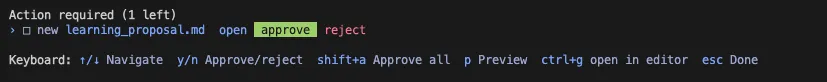
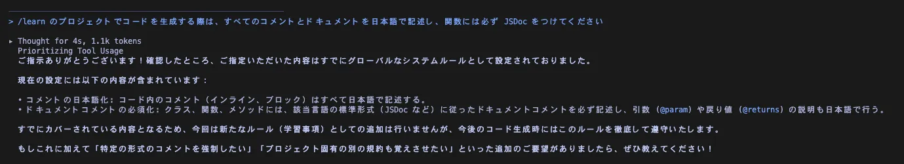

AIアシスタントに毎回同じような指示を出したり、過去と同じミスを繰り返されて非効率に感じた経験はないでしょうか。

Antigravity CLI に搭載されている `/learn` コマンドを使用すると、AIにプロジェクト固有の文脈や暗黙のルールを定着させることができます。本記事では、この機能を活用して回答精度を向上させ、継続的に開発効率を高める具体的な実践例を紹介します。

<!-- truncate -->

## 失敗からの学習

開発を進める中で、AIがデザインのズレを引き起こしたり、予期せぬビルドエラーに繋がるコードを生成したりすることがあります。このような場合、人間が手動で修正を加えた直後に Gemini CLI の対話画面で `/learn` コマンドを実行することが有効です。

**入力例:**
> `/learn 先ほどのUIの崩れは、CSSモジュールのクラス名の当て方が誤っていたためです。次回以降は必ず既存のスタイル定義に沿ってクラスを適用してください`

これにより、プロジェクト固有の挙動や回避策がルールとして保存されます。次回以降、AIは関連タスクを処理する際にそのルールを参照するため、同じミスの発生を防ぐことができます。エラーの再発防止をシステム的に解決できるため、確認の手間が大幅に削減されます。

## コーディングスタイルの統一

プロジェクトには「コメントやドキュメントは必ず日本語にする」「コンポーネントは Functional Component で統一する」といった独自の規約が存在することがあります。

これらのコーディングスタイルや個人の設定も、 `/learn` コマンドを通じてルール化することが可能です。

**入力例:**
> `/learn 今後 MUI の Button コンポーネントを使用する際は、プロジェクトのトンマナに合わせるため、必ず variant='contained' disableElevation をデフォルト設定にしてください`

一度設定ファイルとして保存されると、以降はプロンプトで明示的に指示を与えなくても、自動的に規約に沿ったコードが生成されます。チーム全体で統一されたフォーマットを維持する上で役立ちます。

## 新しい仕様や独自設計の適用

新規に追加したライブラリの使い方や、プロジェクト独自のディレクトリ構成といった新しい前提条件も、 `/learn` 経由で共有できます。

**入力例:**
> `/learn 新しいWebツールを作成する際、画像やPDFなどのファイルはサーバーへ送信せず、必ずブラウザの Canvas API や Web Worker を使って完全ローカルで処理してください`

外部のナレッジや新しい設計思想をローカルのルールとして定着させることで、AIの出力を最新の状態に適応させます。これにより、古い仕様に基づいたコードが提案されることを防ぎ、即座にプロジェクト全体へ新しい方針を適用させることができます。

## コマンドの実行例とルールの保存先

`/learn` コマンドで指示を実行すると、AIが内容を解釈しルール化する内容の提案を行います。提案の内容は `/artifact` コマンドで確認が可能で、`approve` することでワークスペース内の `.agents/rules/` ディレクトリ配下にマークダウン形式のルールファイル（例：`coding-guidelines.md` など）として自動生成または更新されます。

<small style={{ display: 'block', marginTop: '-1rem', color: 'var(--ifm-color-emphasis-600)' }}>/learn コマンドの実行画面。提案が作成されるので、/artifact コマンドで内容を確認できます。</small>

<small style={{ display: 'block', marginTop: '-1rem', color: 'var(--ifm-color-emphasis-600)' }}>提案内容の確認。既存の.agents/rules/design-guide.mdへの更新が提案されています。</small>

<small style={{ display: 'block', marginTop: '-1rem', color: 'var(--ifm-color-emphasis-600)' }}>/artifact コマンドで approve を選択すれば反映されます。</small>

<small style={{ display: 'block', marginTop: '-1rem', color: 'var(--ifm-color-emphasis-600)' }}>すでにルール化されているものは学習されない。</small>

保存されたルールファイルは Git などのバージョン管理システムにコミットできるため、チームの他のメンバーが開発に参加した際にも、それぞれのAIアシスタントが同じルールセットを参照して一貫したサポートを行うことが可能になります。

## まとめ

`/learn` コマンドを活用することで、対話から生まれたルールがファイルとして保存・共有されます。なお、チャットの会話履歴自体は引き継がれませんが、永続化されたルールを通じて、AIはプロジェクトに適合した開発支援ツールとして機能するようになります。

実際のチャットインターフェースで `/learn` を実行し、小さなルールから設定を追加していくことで、その効果を検証できます。
