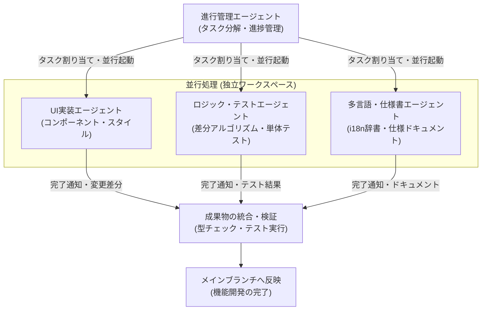
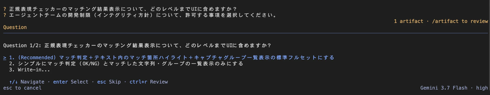
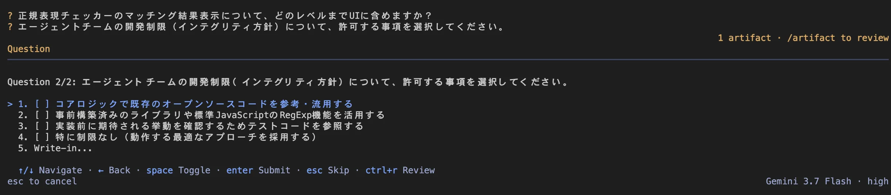
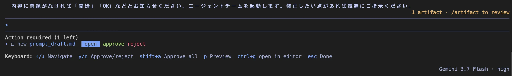
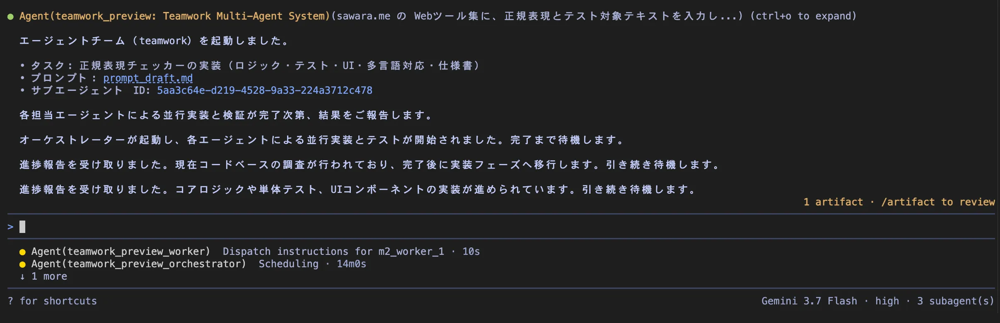

大規模な機能開発やリファクタリングを1つのエージェントにまとめて依頼すると、会話履歴（コンテキスト）が過度に肥大化して回答の精度が低下したり、タスクが順次処理されることで全体の待ち時間が長くなったりすることがあります。

Antigravity CLI に搭載されている `/teamwork-preview` コマンドを使用すると、タスクを複数の専門サブエージェントに自動分割し、並行して作業を進めるチーム型のワークフローを構築できます。本記事では、この機能を活用して複数レイヤーの開発タスクを分担・並行処理させる具体的な実践方法を紹介します。

<!-- truncate -->

## チーム連携（/teamwork-preview）の仕組み

`/teamwork-preview` は、通常のターミナルコマンドではなく、**Antigravity CLI の対話画面（チャットインターフェース）内** で実行するスラッシュコマンドです。

単一のエージェントがすべての作業を順番に行う従来の方式とは異なり、全体の進行を管理するエージェントがタスクを分析し、独立して実行可能な複数のサブエージェントをバックグラウンドで起動します。

各サブエージェントは専用のプロンプトとツールセットを持ち、独立したワークスペース（ブランチや専用ディレクトリ）上で動作します。

エージェントごとに作業空間とコンテキストが切り離されるため、不要なファイル情報でコンテキスト上限を圧迫して回答精度が落ちる心配がありません。また、UIの実装、ロジック作成、テストコードの作成をすべて同時に進められるため、全体の所要時間を大幅に短縮できます。作業ディレクトリやブランチが分かれていることで、同一ファイルの編集による競合や意図しない上書きが発生しない点も大きなメリットです。

## 実践例：Webツールの開発における役割分担

ここでは、「正規表現チェッカー」を新規作成するケースを例に、`/teamwork-preview` によるチーム編成と作業の流れを整理します。

### コマンドの実行

Antigravity CLI の対話画面で、目的とする開発内容を添えてコマンドを入力します。

**入力例:**

> `/teamwork-preview ツール集に「正規表現チェッカー」を追加してください。正規表現とチェックするテキストの2つの入力欄を用意して、テキストが正規表現にマッチしているかどうかチェックする機能です。よくある正規表現のテンプレートも追加してください。Reactコンポーネント、ロジックと単体テスト、多言語辞書の登録および仕様書作成を並行して実装してください。`

コマンドを実行すると、まずエージェント側から要件や開発方針に関する質問が行われます。

<small style={{ display: 'block', marginTop: '-1rem', color: 'var(--ifm-color-emphasis-600)' }}>対話画面での要件確認。ハイライト表示やキャプチャグループの対応レベルを選択します。</small>

<small style={{ display: 'block', marginTop: '-1rem', color: 'var(--ifm-color-emphasis-600)' }}>ライブラリの利用方針や既存ソース参照の可否など、開発制限を選択します。</small>

質問への回答が終わると、チーム編成と各サブエージェントへの指示内容（`prompt_draft.md`）が生成され、承認（approve）を求められます。

<small style={{ display: 'block', marginTop: '-1rem', color: 'var(--ifm-color-emphasis-600)' }}>生成されたプロンプト案（prompt_draft.md）の内容を確認し、承認します。</small>

承認を行うと、オーケストレーターと複数のサブエージェントがバックグラウンドで並行起動し、作業が開始されます。

<small style={{ display: 'block', marginTop: '-1rem', color: 'var(--ifm-color-emphasis-600)' }}>サブエージェントが並行起動し、調査や実装、テストが進められます。</small>

### チーム編成と各エージェントの担当領域

このユースケースでは、主に以下の4つの役割にタスクが分割されます。

| 役割名                             | 主な担当作業                                                             | 主な利用ツール                           |
| :--------------------------------- | :----------------------------------------------------------------------- | :--------------------------------------- |
| **進行管理（オーケストレーター）** | 仕様定義の整理、各サブエージェントへの指示出し、進捗監視、最終マージ     | エージェント管理ツール、メッセージ送受信 |
| **フロントエンド担当**             | 正規表現・テスト文字列の入力フォーム、マッチ結果やハイライト表示UIの実装 | ファイル作成・編集ツール                 |
| **ロジック・テスト担当**           | 正規表現マッチング・バリデーション処理の実装、単体テストの作成           | ファイル編集、テスト実行コマンド         |
| **多言語・ドキュメント担当**       | 日英の辞書ファイル（i18n）へのテキスト登録、仕様書マークダウンの作成     | ファイル編集ツール                       |

各エージェントは独立して動作し、完了したタスクから順次、進行管理エージェントへと結果を通知します。

## 指示出し（プロンプト設計）のポイント

チーム連携を円滑に機能させるためには、エージェント間の作業境界と入出力の定義をあらかじめ明確にしておくことが重要です。

たとえばUI担当とロジック担当が連携する場合、関数の引数や戻り値といった型定義を事前に決めておくことで、後から成果物を結合する際の不整合を防げます。また、各サブエージェントが編集する対象ディレクトリやファイルを最初から分けておくと、マージ作業の自動化もスムーズになります。

さらに、ロジック担当には単体テストの実行、ドキュメント担当にはビルド確認といったように、各担当が個別に完了を判定できる検証手順を指示に含めておくと、手戻りを最小限に抑えられます。

## 進捗のモニタリングと成果物の統合

チーム連携が開始されると、対話画面には各サブエージェントが現在どのツールを実行しているか、あるいは完了待ちの状態かがリアルタイムで表示されます。

独立したワークスペース上で作業が進むため、途中でコミットされた変更差分を個別に確認することも可能です。すべてのサブエージェントがタスクを完了すると、進行管理エージェントがそれぞれの変更をメインブランチにマージし、型チェック（`yarn typecheck` など）やテストを実行して全体の整合性を自動で検証します。

## 単一エージェントとの使い分け基準

すべてのタスクでチーム連携を使用することが最適とは限りません。開発の規模や性質に応じて、単一エージェントでの対話と `/teamwork-preview` を適切に使い分けることが重要です。

| 比較項目             | 単一エージェント（通常対話）               | チーム連携（/teamwork-preview）                        |
| :------------------- | :----------------------------------------- | :----------------------------------------------------- |
| **適したタスク規模** | 単一コンポーネントの修正、小規模なバグ修正 | 複数レイヤーにまたがる機能追加、大規模リファクタリング |
| **実行速度**         | 順次実行（小規模タスクでは最速）           | 並行実行（大規模タスク全体の所要時間を短縮）           |
| **コンテキスト管理** | 1つの会話履歴ですべてを保持                | 各タスクに必要なコンテキストのみに分離                 |
| **トークン消費量**   | 最小限に抑制可能                           | 複数エージェントが並行稼働するため相対的に増加         |

日常的な細かな調整には通常の単一エージェントを用い、構造が明確で複数領域に分割可能な大規模タスクには `/teamwork-preview` を選択するアプローチが効果的であると考えられます。

## まとめ

Antigravity CLI の `/teamwork-preview` を活用することで、複雑な開発タスクを専門エージェントに分散し、並行して安全に進める環境が整います。

開発の規模やタスクの独立性を見極めながら適切なワークフローを選択することが、開発プロセスの効率化につながります。
