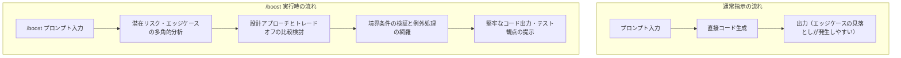

AIアシスタントを活用したコーディングでは、「動作するコード」を素早く生成できる一方で、非同期処理の競合状態（レースコンディション）やアンマウント時のメモリリーク、境界条件のエラーハンドリングといったエッジケースの対応が漏れてしまうことがあります。

こうした潜在的なバグを防ぐためには、人間側が細かく前提条件を指定するか、レビュー時に手動で指摘を重ねる必要がありました。

Antigravity CLI に搭載されている `/boost` コマンドを使用すると、タスクに対して深層思考と多角的な視点による検証が自動的に行われ、エッジケースまで考慮された堅牢なコードを導出できます。本記事では、非同期データ取得を行う React カスタムフックのリファクタリングを題材に、通常指示との違いと具体的な効果を紹介します。

<!-- truncate -->

## /boost コマンドの仕組みと通常指示との違い

`/boost` は、通常のターミナルコマンドではなく、**Antigravity CLI の対話画面（チャットインターフェース）内** で実行するスラッシュコマンドです。

通常のチャット指示では、入力されたプロンプトに対して最も確からしい実装を迅速に出力することが優先されます。一方、プロンプトの先頭に `/boost` を付与すると、エージェントは即座にコードを生成せず、以下のような多角的な検証ステップを経てから回答を導出します。



この処理プロセスにより、表面的なコードの清書にとどまらず、プロダクション環境で問題になりやすい並行処理や境界条件の欠陥を未然に防ぐことが可能になります。

## 検証題材：非同期検索を行うカスタムフック

今回検証する題材は、検索キーワードに応じて外部APIから候補を取得する React のカスタムフック（`useSearch`）です。

### 改善前のコード

以下は、初期実装としてよく見られるコードです。

```typescript
import { useState, useEffect } from 'react';

export function useSearch(query: string) {
  const [data, setData] = useState<string[]>([]);
  const [loading, setLoading] = useState<boolean>(false);

  useEffect(() => {
    if (!query) {
      setData([]);
      return;
    }

    setLoading(true);
    fetch(`/api/search?q=${encodeURIComponent(query)}`)
      .then((res) => res.json())
      .then((result) => {
        setData(result);
        setLoading(false);
      });
  }, [query]);

  return { data, loading };
}
```

この実装には、実運用上で以下のような課題が潜んでいます。

- **競合状態（レースコンディション）**: ユーザーが素早くタイピングした場合、リクエストの送信順とレスポンスの受信順が一致しないことがあります。古いリクエストの応答が最新の入力を上書きしてしまうリスクがあります。
- **リクエストのキャンセル処理の欠如**: 次のリクエストが走った際や、コンポーネントがアンマウントされた際にも通信が継続してしまい、不要なネットワーク負荷が発生します。
- **エラーハンドリングの欠落**: 通信エラー発生時に `loading` が `true` のまま停止し、エラー情報も呼び出し元に通知されません。

## 通常指示によるリファクタリング結果（Before）

まずは `/boost` を付けず、通常のチャット指示でリファクタリングを依頼しました。

**入力プロンプト:**
> `useSearch フックをリファクタリングしてください。エラーハンドリングとローディング状態を追加し、TypeScript の型定義を整えてください。`

### 生成されたコード

```typescript
import { useState, useEffect } from 'react';

interface SearchResult {
  items: string[];
}

export function useSearch(query: string) {
  const [data, setData] = useState<string[]>([]);
  const [loading, setLoading] = useState<boolean>(false);
  const [error, setError] = useState<Error | null>(null);

  useEffect(() => {
    if (!query) {
      setData([]);
      setError(null);
      return;
    }

    setLoading(true);
    setError(null);

    fetch(`/api/search?q=${encodeURIComponent(query)}`)
      .then((res) => {
        if (!res.ok) {
          throw new Error(`検索に失敗しました: ${res.status}`);
        }
        return res.json() as Promise<SearchResult>;
      })
      .then((result) => {
        setData(result.items);
      })
      .catch((err: unknown) => {
        setError(err instanceof Error ? err : new Error('不明なエラー'));
      })
      .finally(() => {
        setLoading(false);
      });
  }, [query]);

  return { data, loading, error };
}
```

指示通り `error` ステートの追加や HTTP ステータスのチェック、型定義の整理が行われ、構文上は整ったコードになりました。

しかし、**`AbortController` による通信のキャンセル処理** や **連続入力時のレスポンス逆転（競合状態）の防止** は依然として考慮されていません。このコードをそのまま本番環境に適用すると、通信速度の揺らぎによって入力欄と検索結果が不一致になるバグが残ってしまいます。

## /boost コマンドによるリファクタリング（After）

次に、同じコードに対して `/boost` コマンドを付与してリファクタリングを依頼しました。

**入力プロンプト:**
> `/boost useSearch フックをリファクタリングしてください。本番環境で安全に動作するよう、エッジケースや設計上のトレードオフを多角的に検証し、堅牢な実装に改善してください。`

コマンドを実行すると、エージェントは直ちにコードを出力せず、内部で次のような検討プロセスを実行したログが表示されました。

- **潜在課題の抽出**: 非同期競合、アンマウント後の状態更新、`AbortError` と通常エラーの区別、空文字・空白文字のサニタイズ。
- **設計トレードオフの比較**: `isCancelled` フラグ方式（受信後に破棄）と `AbortController` 方式（通信自体を中断）を比較し、ネットワークリソースの観点から `AbortController` を採用。
- **例外の選別**: `fetch` を中断した際に発生する `AbortError` は正常系の中断動作であるため、エラー状態（`error`）として扱わない設計を採用。

### 生成されたコード

```typescript
import { useState, useEffect } from 'react';

/**
 * 検索結果の型定義
 */
export interface SearchResult {
  items: string[];
}

/**
 * useSearch フックの戻り値の型定義
 */
export interface UseSearchResult {
  data: string[];
  loading: boolean;
  error: Error | null;
}

/**
 * 非同期検索を安全に行うカスタムフック
 * @param query - 検索キーワード
 * @returns 検索結果、ローディング状態、エラーオブジェクト
 */
export function useSearch(query: string): UseSearchResult {
  const [data, setData] = useState<string[]>([]);
  const [loading, setLoading] = useState<boolean>(false);
  const [error, setError] = useState<Error | null>(null);

  useEffect(() => {
    const trimmedQuery = query.trim();

    // 空白文字または空文字列の場合は即座にリセット
    if (!trimmedQuery) {
      setData([]);
      setLoading(false);
      setError(null);
      return;
    }

    // 最新のリクエスト以外を中断するための AbortController
    const controller = new AbortController();
    const { signal } = controller;

    setLoading(true);
    setError(null);

    async function executeSearch() {
      try {
        const response = await fetch(
          `/api/search?q=${encodeURIComponent(trimmedQuery)}`,
          { signal }
        );

        if (!response.ok) {
          throw new Error(`HTTPエラー: ステータスコード ${response.status}`);
        }

        const json: SearchResult = await response.json();

        // 中断されていない場合のみ状態を更新
        if (!signal.aborted) {
          setData(json.items);
        }
      } catch (err: unknown) {
        // AbortController による中断は正常なキャンセル処理として無視
        if (err instanceof Error && err.name === 'AbortError') {
          return;
        }

        if (!signal.aborted) {
          setError(
            err instanceof Error
              ? err
              : new Error('検索処理中に予期せぬエラーが発生しました')
          );
        }
      } finally {
        if (!signal.aborted) {
          setLoading(false);
        }
      }
    }

    executeSearch();

    // クリーンアップ処理：クエリ変更時またはアンマウント時に通信を中断
    return () => {
      controller.abort();
    };
  }, [query]);

  return { data, loading, error };
}
```

### `/boost` によってカバーされた具体的なポイント

1. **`AbortController` によるリクエストの中断**:
   クエリが更新されるたび、クリーンアップ関数で直前の通信を中断します。これにより、古い通信の完了待ちがなくなり、最新のクエリに対する結果のみが確実に反映されます。
2. **`AbortError` の適切な除外**:
   通信中断時にブラウザが投げる `AbortError` を捕捉し、これをアプリケーションエラーとして扱わない分岐を設けています。通常指示ではこの区別が見落とされ、画面に「エラーが発生しました」と誤表示されるケースが多く見られます。
3. **入力値のトリム処理と早期リターン**:
   スペースのみが入力された場合の不要なAPIリクエストを防止し、ステートを安全に初期化しています。
4. **JSDoc と型安全性の徹底**:
   関数の責務、引数、戻り値の型定義が網羅されており、プロジェクトの品質基準を満たす構造になっています。

## /boost のデメリットと注意点（トレードオフ）

`/boost` はエッジケースの網羅や堅牢な設計に非常に有効ですが、万能の特効薬ではなく、明確なトレードオフが存在します。

### 応答待ち時間（レイテンシ）の増加
通常指示では数秒〜十数秒でコードの出力が開始されますが、`/boost` を適用すると、内部で「潜在リスクの分析」「設計トレードオフの比較」「検証」といった複数の思考プロセス（Extended Thinking）を経由します。そのため、回答の生成完了までに通常の数倍の時間がかかります。テンポよく試行錯誤したい場面では待ち時間がストレスになり得ます。

### トークン消費量とコンテキストウィンドウの圧迫
思考プロセス自体に大量のトークン（Thinking トークン）が消費されるほか、多角的な検討ログや詳細な型定義、テスト観点なども出力されるため、1回の指示で消費されるトークン数が通常指示の数倍〜十数倍に跳ね上がります。
これにより、APIの利用枠やレートリミット（TPM / RPM）を急激に消費しやすくなるほか、チャットセッション全体のコンテキスト上限に早く到達してしまう点に注意が必要です。

### オーバーエンジニアリング（過剰設計）のリスク
「ボタンのスタイルを調整する」「型のプロパティを1つ足す」「タイポを直す」といった単純な定型作業に `/boost` を使用すると、不要な抽象化レイヤーや過度な防御的プログラミング、複雑な例外ハンドリングが導入され、かえってコードの見通しや保守性を損ねる（YAGNI原則に反する）可能性があります。

## /boost を使い分けるポイント

これらのトレードオフを踏まえ、タスクの難易度や性質に応じて通常指示と使い分けることが肝要です。

タスクの特性に応じて使い分けることが効率的です。

| 指示タイプ | 適した作業内容                                                                 | 例                                               |
| :--------- | :----------------------------------------------------------------------------- | :----------------------------------------------- |
| **通常指示** | 定型的なUI作成、単純なCRUD操作、テキストの編集、単一の明確な関数実装           | 「ボタンのスタイルを変更して」「Propsの型を追加して」 |
| **/boost** | 並行処理や非同期競合の制御、複雑な状態遷移の設計、難度の高いバグ修正、アーキテクチャ設計 | 「状態管理ロジックのリファクタリング」「エッジケースを含めたAPIクライアントの実装」 |

また、`/boost` を使用する際は、懸念している観点をプロンプトに一言添えると、さらに精度の高い分析が行われます。

**効果的なプロンプトの例:**
> `/boost このキャッシュ管理クラスの並行アクセス制御をレビューしてください。デッドロックのリスクや、メモリリークの可能性について多角的に検証し、改善案を提示してください。`

## まとめ

コード生成AIの利用において、「一見動いているがエッジケースで破綻するコード」のレビューは開発者の大きな負担となります。

Antigravity CLI の `/boost` コマンドを活用することで、エージェント側で事前に潜在リスクの洗い出しとトレードオフの比較が行われ、手戻りの少ない堅牢なコードを導出できました。

設計の堅牢性や品質が重視される局面では、通常の指示に `/boost` を組み合わせるアプローチが有効であると考えられます。
