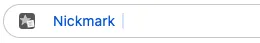
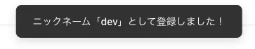
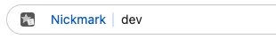
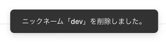

import ToolPageHeader from '@site/src/components/ToolPageHeader';
import ExtensionDownloadSection from '@site/src/components/ExtensionDownloadSection';
import NickmarkPng from '@site/src/icons/Nickmark.png';

<ToolPageHeader
  title="Nickmark"
  desc="アドレスバー（オムニボックス）からニックネーム（別名）を使ってブックマークへ瞬時にアクセスするための、キーボード操作特化型 Chrome 拡張機能です。"
  icon={}
  color1="#3b82f6"
  color2="#1e3a8a"
/>

<ExtensionDownloadSection
  title="入手方法"
  links={[
    { label: 'Chrome ウェブストア', href: 'https://chromewebstore.google.com/detail/nickmark/bicojpjoabhecikokcohbjgaiojggpno' },
    { label: 'Microsoft Edge', isComingSoon: true }
  ]}
/>

---

## 基本的な使い方

### 1. ブックマークを登録する

1. ブックマークに登録したいページを開く
1. `Ctrl + L` (または `Cmd + L`) でアドレスバーへ移動
2. `nm`と入力して、  
    
  `Space`を入力するとNickmarkが起動します  
    
  そのまま`:add dev` と入力して  
    
  `Enter` を入力してブックマークが登録します  
  

これで現在のページが「dev」というニックネームで保存されました。

### 2. ブックマークを使う
登録した「dev」にアクセスするには、

1. `Ctrl + L` (または `Cmd + L`) でアドレスバーへ移動
2. `nm` + `Space` + `dev` と入力して `Enter`  
  

これで「dev」というニックネームに登録したページへ遷移します。

:::tip
Nickmark起動後、ニックネームの入力中にブックマークがサジェストされますので、ニックネームを全て入力しなくても、サジェストの中から選択してブックマークのページにアクセスできます。
:::

:::tip
同じニックネームで複数のURLを登録することができるため、以下のような使い方ができます。
- **ToDoリストとして利用**  
  あとで見るものや、返信が必要なメッセージツールのURLを全て`todo`として登録しておき、`nm todo`と入力して、表示されたサジェストから選んで消化していく。
- **「開発セット」を爆速で開く**  
  GitHub, ローカル環境, ドキュメントをすべて `dev` に登録しておき、`nm :o dev`と入力して`dev`で登録した全てのブックマークを一度に開く。
:::

### 3. ブックマークを削除する
登録した「dev」を削除するには、

1. `Ctrl + L` (または `Cmd + L`) でアドレスバーへ移動
2. `nm` + `Space` を入力して、Nickmarkを起動します。  
    
  そのまま`:rm dev` と入力して  
    
  `Enter` を入力してブックマークを削除します。  
    

これで「dev」というニックネームが削除されました。

:::tip
`:rm`入力後、削除候補がサジェストされますので、サジェストの中から選択して削除することもできます。
:::

---

## 通常モード（ナビゲーション）

アドレスバーで `nm` + `Space` の後に**ニックネーム**を入力するモードです。

- **基本的な挙動**: 入力したニックネームに一致する URL が候補として表示されます。
- **インクリメンタル検索**: 文字を入力するたびに、リアルタイムで候補が絞り込まれます。
- **インテリジェント遷移**: `Enter` を押すと、リストの最上位にある URL へ遷移します。
- **複数候補の選択**: 同じニックネームに複数の URL がある場合、`Tab` キーや `矢印キー` で候補を選択できます。

### 指数減衰スコアリング
Nickmark は「どの URL を最近よく使っているか」を学習します。
- 頻繁にアクセスする URL は自動的にスコアが上がり、候補の最上位に表示されるようになります。
- しばらく使っていない URL は徐々にスコアが下がり、優先順位が落ちます。

---

## コマンドモード

アドレスバーで `nm` + `Space` の後に**コロン `:`** から始まるキーワードを入力するモードです。ブックマークの追加・削除や拡張機能の設定を行います。

### `:add [ニックネーム] [タイトル(任意)]`
現在のタブを登録します。
- **ニックネーム**: 必須。自分が覚えやすい名前（例: `gh`, `jira`）を指定します。
- **タイトル**: 省略可能。省略した場合は、Web ページのタイトルがそのまま登録されます。
- **例**: `:add note 議事録メモ`

### `:ls`
ブックマーク一覧を開きます。
- 登録したすべてのニックネームと URL を確認、編集、削除できます。
- JSON 形式での編集も可能です。

### `:open [ニックネーム]`（エイリアス `:o`）
別タブでブックマークを開きます。
- **例**: `:o note`

### `:rm [ニックネーム]`
指定したニックネームを削除します。
- **例**: `:rm old-site`

---


## 📥 JSONの仕様
ブックマーク一覧画面では、以下の仕様に基づいた JSON 形式でデータを編集することができます。

### フィールドの説明
- **`bookmarks`**: ルートとなるオブジェクトです。
  - **`{ニックネーム}`**: `bookmarks` 内の各キーがニックネームとなります。値はブックマークの配列です。
    - **`url`**: 遷移先のURLです（必須）。
    - **`title`**: ブックマークのタイトルです。
    - **`score`**: 使用頻度などに基づくスコアです。スコアが大きほうがサジェスト時の優先順位が上がります。
    - **`last_used_at`**: 最後に使用した日時のタイムスタンプ（ミリ秒）です。
    - **`created_at`**: ブックマークを登録した日時のタイムスタンプ（ミリ秒）です。

### 具体的な例
```json
{
  "bookmarks": {
    "google": [
      {
        "url": "https://www.google.com",
        "title": "Google",
        "score": 10.0,
        "last_used_at": 1715731200000,
        "created_at": 1715731200000
      }
    ],
    "github": [
      {
        "url": "https://github.com",
        "title": "GitHub",
        "score": 5.0,
        "last_used_at": 1715731300000,
        "created_at": 1715731100000
      }
    ]
  }
}
