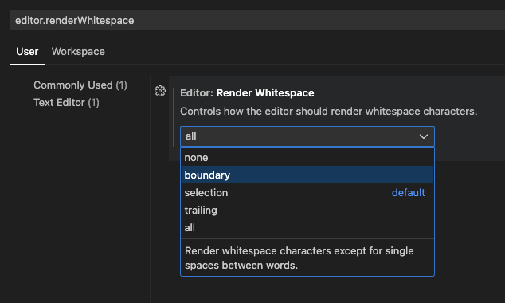
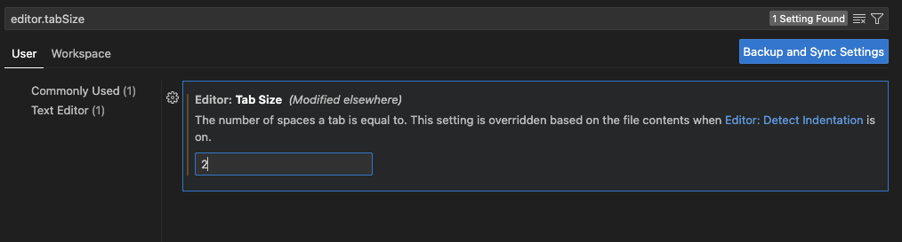

# Install and setup

# Install

homebrewでインストール

```bash
brew search visual-studio-code
```

## Setup

VisualStudioCodeの基本設定

### スペースを表示

`Command + ,`キーで設定を開いて`editor.renderWhitespace`で検索し、`none`意外に設定する




### インデント幅変更

`Command + ,`キーで設定を開いて`editor.tabSize`で検索し、`2`に設定する




## Extentions

### Vim

エディタの入力をVimライクにしてくれるやつ


### Project Manager

プロジェクトマネージャー


### GitLens


