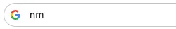
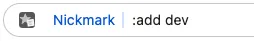
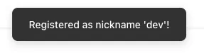
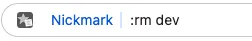
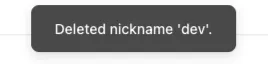

import ToolPageHeader from '@site/src/components/ToolPageHeader';
import ExtensionDownloadSection from '@site/src/components/ExtensionDownloadSection';
import NickmarkPng from '@site/src/icons/Nickmark.png';

<ToolPageHeader
  title="Nickmark"
  desc="A keyboard-optimized Chrome extension for instantly accessing your bookmarks using nicknames (aliases) directly from the address bar (omnibox)."
  icon={}
  color1="#3b82f6"
  color2="#1e3a8a"
/>

<ExtensionDownloadSection
  title="Get Nickmark"
  links={[
    { label: 'Chrome Web Store', href: 'https://chromewebstore.google.com/detail/nickmark/bicojpjoabhecikokcohbjgaiojggpno' },
    { label: 'Microsoft Edge', isComingSoon: true }
  ]}
/>

---

## Basic Usage

### 1. Adding a Bookmark

1. Open the page you want to bookmark.
2. Move to the address bar with `Ctrl + L` (or `Cmd + L`).
3. Type `nm`, then  
    
  press `Space` to activate Nickmark.  
    
  Type `:add dev` and  
    
  press `Enter` to register the bookmark.  
  

Now the current page is saved with the nickname "dev".

### 2. Using a Bookmark
To access the registered "dev":

1. Move to the address bar with `Ctrl + L` (or `Cmd + L`).
2. Type `nm` + `Space` + `dev` and press `Enter`.  
  

You will be redirected to the page registered with the nickname "dev".

:::tip
After activating Nickmark, bookmarks are suggested while you type the nickname. You can access the bookmarked page by selecting from the suggestions without typing the entire nickname.
:::

:::tip
Since you can register multiple URLs with the same nickname, you can use it in the following ways:
- **Use as a To-Do List**  
  Register all URLs for things to see later or messages needing a reply as `todo`. Type `nm todo` and pick from the suggestions.
- **Open a "Development Set" Instantly**  
  Register GitHub, local environment, and documentation all as `dev`. Type `nm :o dev` to open all bookmarks registered under `dev` at once.
:::

### 3. Deleting a Bookmark
To delete the registered "dev":

1. Move to the address bar with `Ctrl + L` (or `Cmd + L`).
2. Type `nm` + `Space` to activate Nickmark.  
    
  Type `:rm dev` and  
    
  press `Enter` to delete the bookmark.  
  

The nickname "dev" has now been deleted.

:::tip
After typing `:rm`, deletion candidates are suggested, so you can also select from the suggestions to delete.
:::

---

## Normal Mode (Navigation)

This mode is used when you type a **nickname** after `nm` + `Space` in the address bar.

- **Basic Behavior**: URLs matching the entered nickname are displayed as candidates.
- **Incremental Search**: Candidates are filtered in real-time as you type.
- **Intelligent Navigation**: Press `Enter` to navigate to the top URL in the list.
- **Selecting Multiple Candidates**: If multiple URLs share the same nickname, you can use the `Tab` or `arrow keys` to select a candidate.

### Exponential Decay Scoring
Nickmark learns "which URLs you use frequently/recently."
- Frequently accessed URLs automatically gain higher scores and appear at the top of the suggestions.
- URLs not used for a while gradually lose score and drop in priority.

---

## Command Mode

This mode is used when you type keywords starting with a **colon `:`** after `nm` + `Space` in the address bar. It allows you to add/remove bookmarks and configure extension settings.

### `:add [nickname] [title (optional)]`
Registers the current tab.
- **nickname**: Required. A name easy for you to remember (e.g., `gh`, `jira`).
- **title**: Optional. If omitted, the web page's title is used.
- **Example**: `:add note Meeting Minutes`

### `:ls`
Opens the bookmark list.
- You can view, edit, and delete all registered nicknames and URLs.
- Editing in JSON format is also possible.

### `:open [nickname]` (alias `:o`)
Opens bookmarks in new tabs.
- **Example**: `:o note`

### `:rm [nickname]`
Deletes the specified nickname.
- **Example**: `:rm old-site`

---

## 📥 JSON Specification
On the bookmark list screen, you can edit data in JSON format based on the following specifications.

### Field Descriptions
- **`bookmarks`**: The root object.
  - **`{nickname}`**: Each key within `bookmarks` is a nickname. The value is an array of bookmark objects.
    - **`url`**: The destination URL (required).
    - **`title`**: The title of the bookmark.
    - **`score`**: A score based on usage frequency, etc. Higher scores increase priority in suggestions.
    - **`last_used_at`**: Timestamp (milliseconds) of when it was last used.
    - **`created_at`**: Timestamp (milliseconds) of when the bookmark was registered.

### Example
```json
{
  "bookmarks": {
    "google": [
      {
        "url": "https://www.google.com",
        "title": "Google",
        "score": 10.0,
        "last_used_at": 1715731200000,
        "created_at": 1715731200000
      }
    ],
    "github": [
      {
        "url": "https://github.com",
        "title": "GitHub",
        "score": 5.0,
        "last_used_at": 1715731300000,
        "created_at": 1715731100000
      }
    ]
  }
}
```
